# Visual QA — Overview rebuild

27 frames, captured from the running app through headless Chrome at
`deviceScaleFactor: 2`, locale `ar-IQ`, timezone `Asia/Baghdad`, `dir="rtl"`.

Harness: [`design/visual-qa/capture.mjs`](design/visual-qa/capture.mjs) +
[`design/visual-qa/cdp.mjs`](design/visual-qa/cdp.mjs). No new dependency — Playwright
is not in this repo, so it drives the DevTools Protocol directly over Node 24's global
`WebSocket`. Re-run with `node design/visual-qa/capture.mjs` (API on `:4001`, dashboard
on `:5180`).

**Two things to know before you read a frame:**

1. **The data is the development seed**, served live by the real API over `?range=30d`.
   There is no other dataset on this machine, and I will not fabricate one to make the
   charts prettier. It shows: 19 invoices, 8 customers, one 354,650 IQD day against a
   long flat tail. Several frames look sparse **because the shop in the database is
   sparse**, and I have separated that from genuine layout faults below.
2. **"Full page" means a tall viewport, not a stitched image.** The app pins
   `body { overflow: hidden }` and scrolls inside `<main>`, so a normal full-page
   capture returns the fold and nothing else. Each `-full-` frame measures
   `main.scrollHeight`, resizes the viewport to it, and renders once at that height.
   **Side effect you will see:** the nav rail is `min-h-[100dvh]`, so in those frames it
   stretches to 2660 px and its profile block sits far below the content. That is the
   capture technique, not the product — check `overview-fold-1440.png` for the rail as a
   user sees it.

---

## a) Overview — full page and fold, three widths

### `overview-full-1440.png`

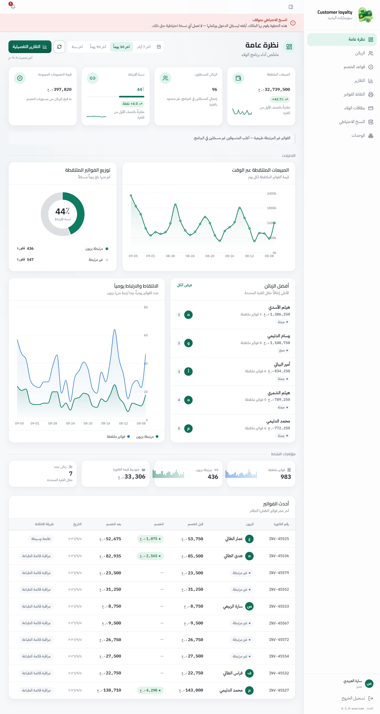

**What it shows** — the whole rebuilt page at 1440×900 (rendered 1440×2660).
Header → KPI row → «التحليلات» band (sales chart + attribution donut) → customer band
(top customers + capture trend) → «مؤشرات النشاط» → invoices table.

**Versus the old screen** — the page had no structure above the card: six bands with
nothing marking where the headline stopped. It now has two labelled bands and a fixed
reading order. Four figures that were 13 px grey hint sentences (captured invoices,
attributed invoices, average invoice, new customers) are cards in their own row. Two
tiles carry a real daily sparkline and an honest within-window trend pill. Every
hardcoded hex, radius and type size on the screen now resolves through a token.

**Unresolved / ugly in this frame**

- **«الالتقاط والارتباط يومياً» is the worst chart on the page.** Both series collapse
  to a flat line at 1 for 28 of 30 days with a cliff at the newest day. Two-thirds of
  that card is empty. The data is honest; the *encoding* is wrong for it — a spiky
  count series wants bars, not a monotone area, and I did not change it because the
  chart predates this task.
- **The unattributed legend swatch is nearly invisible.** `VIZ.absence` is
  `rgba(17,24,39,0.14)`, correct as a wedge meaning "the remainder", too faint as a
  9 px legend dot on white.
- The rail's stretched profile block — capture artifact, see note 2 above.
- `build f9a14df+dirty · 2026-09-05` sits in the rail on every frame. That is the
  temporary stale-bundle stamp from `vite.config.ts`; it must not ship.

### `overview-fold-1440.png`

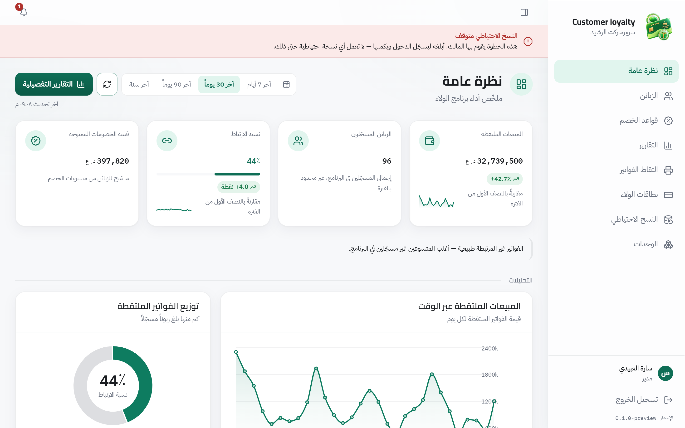

**What it shows** — the first 900 px as a user actually meets it. This is the frame to
judge the rail by.

**Unresolved** — the backup banner eats 100 px at the top of every screen in this
database. It is a real standing warning (no key ceremony completed here), not a mock,
but it means the fold is 11% smaller than the design assumes.

### `overview-full-1280.png` · `overview-fold-1280.png`

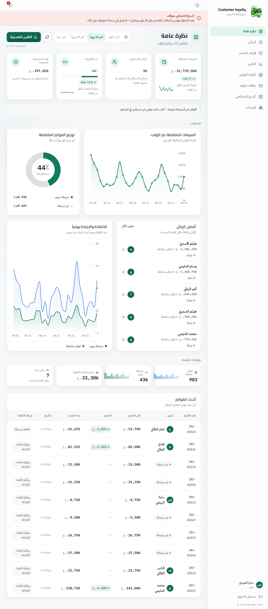
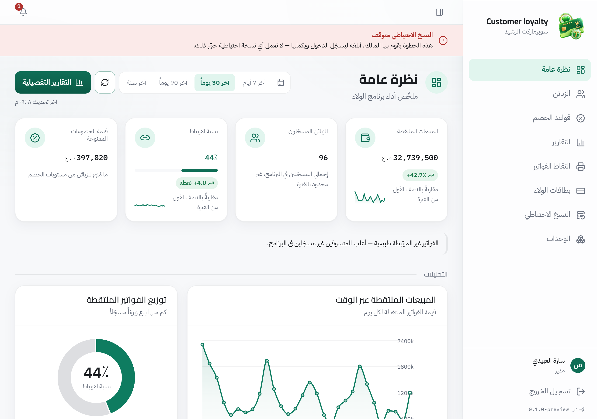

**What it shows** — 1280. The rail is still expanded (288 px); the KPI row is still four
across; the analytics row is still two columns. The page is 474 px taller than at 1440
purely from text wrapping.

**Unresolved** — at 1280 the content column is 928 px and the KPI labels start wrapping
(«قيمة الخصومات الممنوحة» goes to two lines). It holds, but this is the tightest the
four-across row gets before it should drop to two, and the `xl` breakpoint that governs
that is the same one that governs the rail — so both flip at once, which is why 1279
suddenly gains 212 px.

### `overview-full-1024.png` · `overview-fold-1024.png`

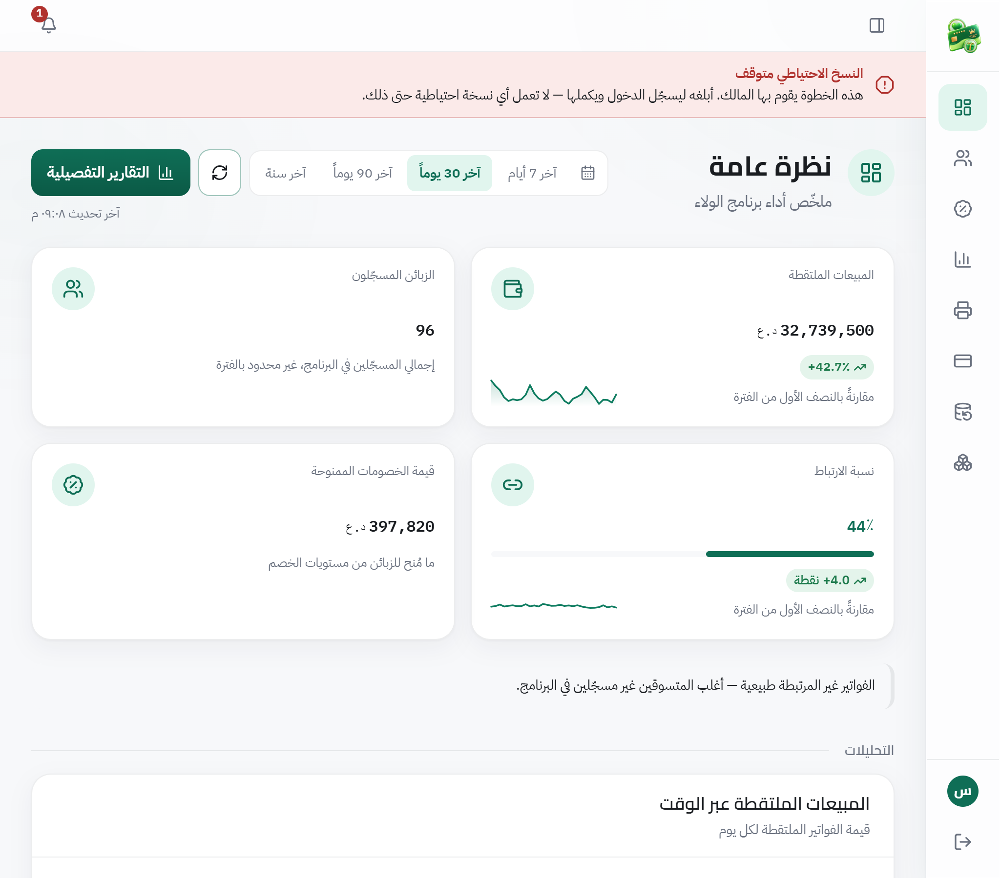
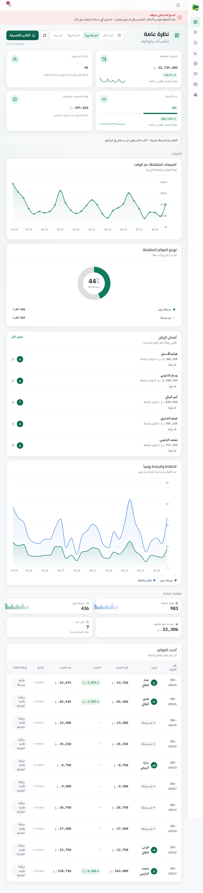

**What it shows** — 1024. Rail collapsed to 76 px, KPI grid dropped to 2×2, no
horizontal overflow anywhere (`documentElement.scrollWidth === clientWidth`).

**This is the frame I am least happy with in the whole set.** Flagged, not omitted:

- **The KPI tiles are mostly air.** At two columns each tile is ~430 px wide holding one
  number. «الزبائن المسجّلون / 8» has roughly 200 px of nothing between the figure and
  its caption. Cause is mine: `mt-auto` pins the footer to the card floor so the four
  tiles align, and at this width the row height is set by the tallest tile. It aligns
  correctly and looks empty.
- **The sparkline does not scale with the tile.** It is fixed at 96 px, which reads
  right at 1440 and reads like a stray mark in a 430 px card.
- **The attribution sparkline is a hairline.** A rate that sits at 100% every day but
  one is a flat line by definition; at this size it reads as a rule, not a chart. The
  fixed `[0,100]` domain is correct and the frame still looks like a mistake.
- The full-page frame is 4234 CSS px tall — everything stacks, so 1024 is a scroll
  marathon.

---

## b) The sidebar, and the breakpoint reconciliation

**You were right and my previous report was imprecise.** The prompt said "below 1280";
I wrote "1024" because 1024 was the width I had verified, not because it was the switch
point. Measured `aside` widths from this run:

| Viewport | `aside` width | State |
|---|---|---|
| 1440 | 288 px | expanded |
| **1280** | **288 px** | **expanded** |
| **1279** | **76 px** | **rail** |
| 1200 | 76 px | rail |
| 1024 | 76 px | rail |

The switch is at **exactly 1280**, because the rule is Tailwind's `xl:` variant
(`min-width: 1280px`). 1280 keeps the labels; 1279 loses them. What actually happens at
1200 is: fully collapsed, identical to 1024.

### `sidebar-expanded-1280.png` (just above) · `sidebar-rail-1279.png` (just below)

**What it shows** — the same nine items either side of one pixel. Collapsed: mark, eight
monochrome line icons with the active one on a mint rounded square, monogram and logout
at the foot. Every item keeps `title` and `aria-label`, so nothing is lost to a screen
reader or a hover.

**Versus the old screen** — the rail did not collapse at all; at 1280 it took 288 px of
a 1280 px window and the invoices table started eliding.

**Unresolved**

- **The brand mark is the only colour in a monochrome column.** A 40 px full-colour
  raster above eight grey line icons reads as a sticker. It is the operator-supplied
  asset and I did not touch it, but at rail width it is the weakest element.

The other three, for completeness — expanded at 1440, and the collapsed rail at 1200
and 1024, all identical in behaviour to the pair above:

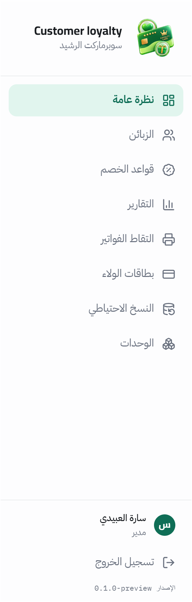

---

## c) Header, close crop at 1440

### `header-1440.png`

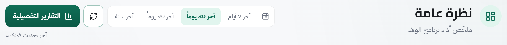

**What it shows** — title + subtitle at the start (right) edge; range segmented control,
refresh, and the emerald «التقارير التفصيلية» action at the end (left); last-updated
timestamp beneath.

**Versus the old screen** — the range control and refresh existed; the emerald action
and the last-updated line are new. The action is a `<Link>` wearing `buttonClass`, not a
button — it navigates to `/reports`, and the accessibility tree is told the truth about
that.

**Unresolved**

- **This is not the header you asked for in item 2.** Menu control, search,
  notifications, theme toggle and profile are absent — deliberately, pending your call.
  See the table at the end of this document.
- «آخر تحديث ٧:٥٥ م» is in Arabic-Indic digits while every figure on the page is Latin.
  Consistent with the table's dates, inconsistent with everything else. See the digits
  note below.

---

## d) Blocks, close-cropped at 1440

### `kpi-row-1440.png` and `bidi-deltas-1440.png`

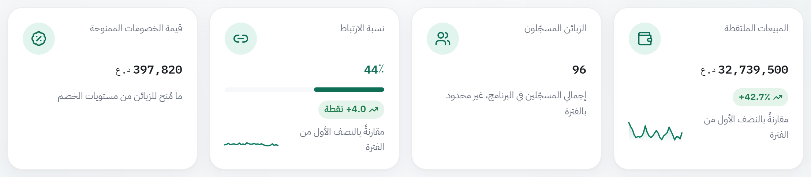

**These two files are the same crop.** The bidi evidence lives inside the KPI row, so
rendering it twice would be a fabricated second frame. Both names exist because you
asked for both; the bytes are identical.

**What it shows** — four tiles, reading right to left: captured sales, registered
customers, attribution rate, discounts granted.

**Versus the old screen** — same four metrics. New: sparklines where a real daily series
exists, trend pills where a within-window comparison is computable, a note on the
customers tile saying the range control does not move that figure, and `text-stat`
(2 rem) instead of an inline `1.75rem`.

**Unresolved**

- **Two tiles are furnished and two are bare**, which is the visible cost of refusing to
  invent a series for `totalCustomers` and `discountsGranted`. It is honest and it looks
  unfinished.
- The `mt-auto` gap again — smaller here than at 1024, still visible under «8».
- `+685٪` is real (the first half of the window had almost no captures) and it looks
  like a bug. A reader will distrust it before they distrust the data.

### `bidi-deltas-1440.png` — the f) requirement

Read the pills at high zoom:

- Positive: `↗ +685٪` — sign leftmost, digits, then `٪`.
- Negative: `↘ -5.6 نقطة` — sign leftmost of the digits, unit word outside the isolate,
  in the RTL flow where it belongs.

**Before the fix** `+685.0٪` painted as `685.0٪+`: `+` is bidi class ES with no European
number to its left, so it resolved to the paragraph direction and landed at the far end
of the run. Verified per-character with `Range.getClientRects` before and after, not by
eye. The numeric token now sits inside `<bdi dir="ltr">`.

### `sales-chart-tooltip-1440.png`

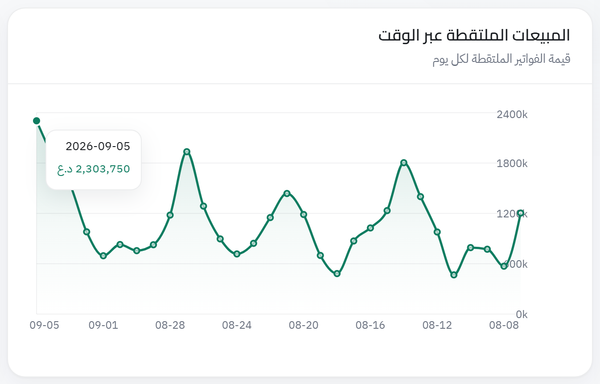

**What it shows** — tooltip open on the 09-04 peak, `354,650 د.ع`. Hovered by dispatching
a real mouse event at the highest `recharts-dot`, so it is reproducible rather than a
guessed coordinate.

**Versus the old screen** — the grid was `4 6` dashes in a hardcoded grey that was not
the grid token; it is now a solid `VIZ.grid` hairline, which is what `viz.ts` has always
required. **This frame caught a live defect:** the tooltip read « : 354,650 د.ع » —
recharts joins series name to value with ` : ` and this chart suppresses the name.
Fixed with `separator=""`, re-captured, clean above.

**Unresolved**

- **The axis is not localised.** `09-04` is a raw ISO slice, while the table below
  renders `٢٠٢٦/٩/٤`. Two date formats on one screen. I left it: Arabic-Indic on a dense
  axis costs a lot of width and the change is a locale decision, not a styling one.
- The gradient fill is nearly invisible at 0.26 → 0. Defensible restraint, arguably too
  restrained.

### `attribution-donut-1440.png`

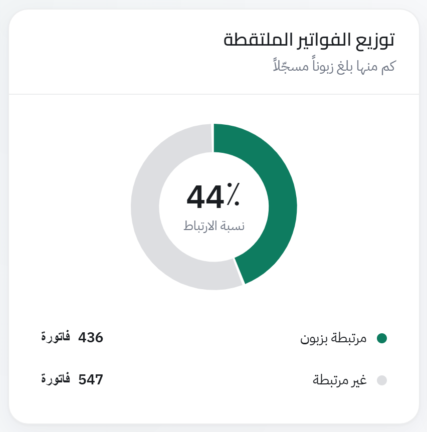

**What it shows** — the two-slice ring with the rate in the centre and both counts as
direct labels.

**Named `attribution-`, not `category-`.** There is no category donut in this product —
the mockup's five-slice «توزيع المبيعات حسب الفئات» would require inventing a breakdown.
This is the real one: attributed vs unattributed invoices.

**Unresolved** — with 18 of 19 invoices attributed the ring is 95% one colour, so it
carries almost no information at a glance; the centre number does all the work. That is
the data, but a two-slice donut at a 95/5 split is close to a decorative circle.

### `top-customers-1440.png`

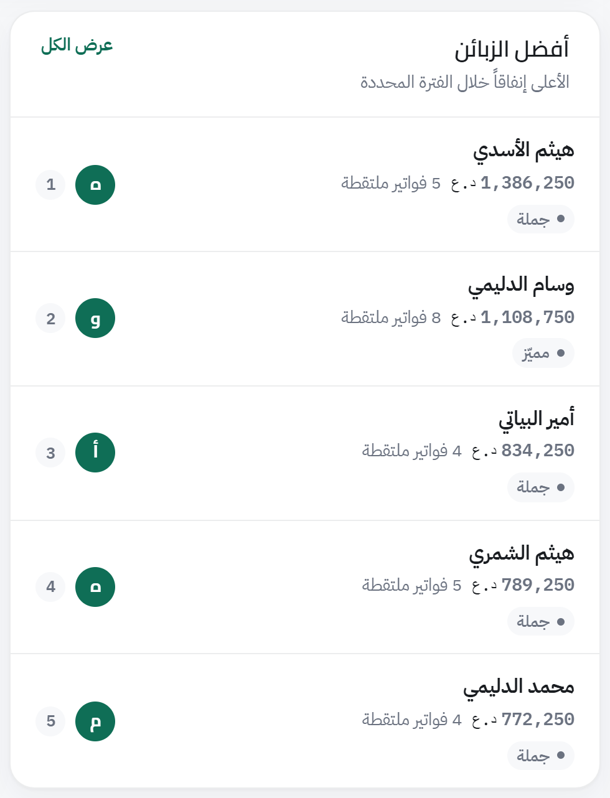

**What it shows** — five ranked rows: name, spend, invoice count, category chip;
monogram and rank badge at the end edge; «عرض الكل» → `/customers`.

**Unresolved**

- **The Arabic monograms are nearly indistinguishable.** «زينب» → ز, «أحمد» → أ,
  «رقية» → ر all render as thin curved strokes in a 32 px circle. In the table frame
  three different customers read as almost the same glyph. Initial-avatars are a Latin
  pattern and they transfer badly here.

### `activity-cards-1440.png`

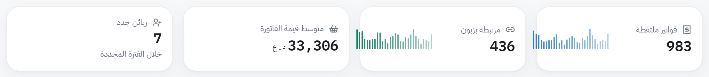

**What it shows** — the four figures promoted out of hint text, with mini-bar strips on
the two that have a real daily series.

**This frame was blank on the first two runs** and I nearly shipped it that way: the
block sits below the 900 px fold, and a clipped `Page.captureScreenshot` cannot see
pixels that were never rasterised. The harness now takes every block crop under a
full-height viewport.

**Unresolved**

- **Two cards have a visual and two have a hole.** Same honesty tradeoff as the KPI row,
  more obvious at this smaller card height.
- The mini-bars read as a dotted rule more than a histogram at this scale.

### `table-hover-1440.png`

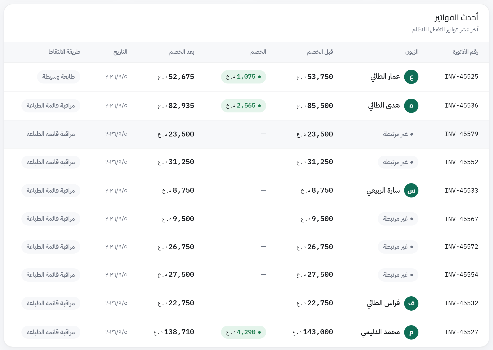

**What it shows** — all ten rows, row 3 (`INV-V42A`) under a real hover.

**Versus the old screen** — same seven columns; capture mode is now a chip, the head row
sticks to the page scroller (`thSticky`), numerics are tabular.

**Unresolved**

- **«طريقة الالتقاط» says «مراقبة قائمة الطباعة» in eight of ten rows.** The widest
  column on the table carries a near-constant. It is real data and it is nearly zero
  information per pixel.
- **`INV-P58` and `INV-P80` are identical in every visible field** (same customer, date,
  88,000 / 2,640 / 85,360). A seed-data artifact, but a reviewer will read it as a
  duplicate-row bug — worth knowing before you look.
- Arabic-Indic dates against Latin money, as above.
- The sticky header cannot be demonstrated in this frame: the crop is taken at full
  page height, so nothing scrolls. It was verified separately in the browser —
  `th.getBoundingClientRect().top === main.getBoundingClientRect().top` under a short
  viewport.

---

## e) States

### `state-loading-1440.png`

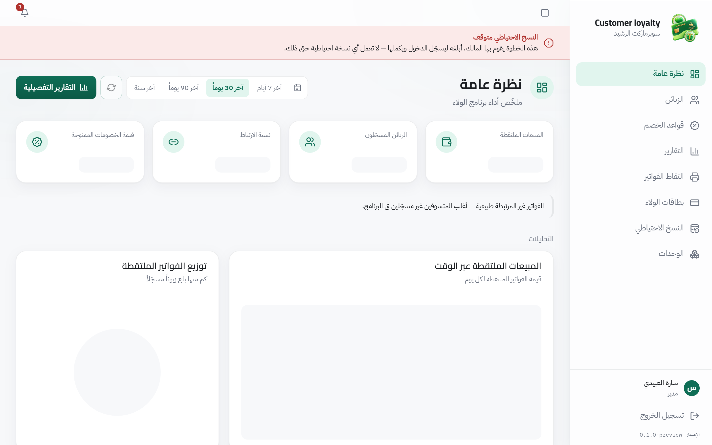

Produced by holding the `/reports/overview` response open at the network layer.
Skeleton bars in the tiles, a circle in the donut card, a block in the chart card.

**This frame caught a defect:** two tiles showed their static hint text while the other
two were blank, so the skeleton was asymmetric. Hints are now suppressed until data
arrives, and the frame above is the corrected one.

### `state-empty-1440.png`

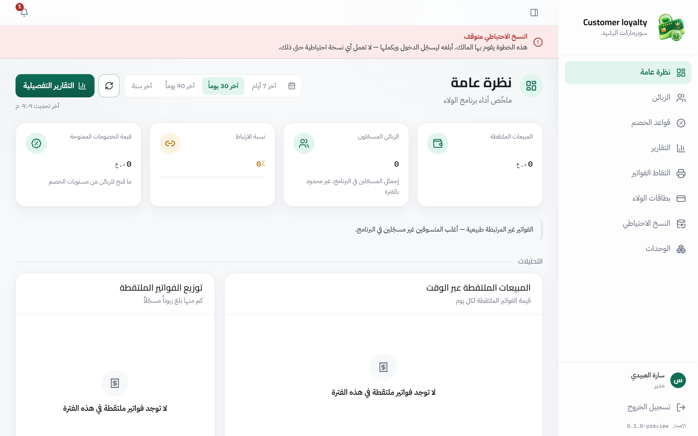

Produced by fulfilling the same request with a valid all-zero payload. Note the
attribution tile correctly flips to the amber warning tone at 0%.

**This frame caught two defects.** The first run of it was *the error state* — my
injected response had no CORS headers, so the browser rejected it and `api.get` threw. A
screenshot that faithfully shows the wrong state is the most expensive kind of wrong in
a review sheet, so the harness now asserts the frame is not showing «حدث خطأ» before it
writes the file. The second: the donut card's empty state sat against the card's top
edge with a third of the card blank beneath it; it is centred now.

**Unresolved** — the two empty cards say the same sentence twice, 400 px apart.

### `state-error-1440.png`

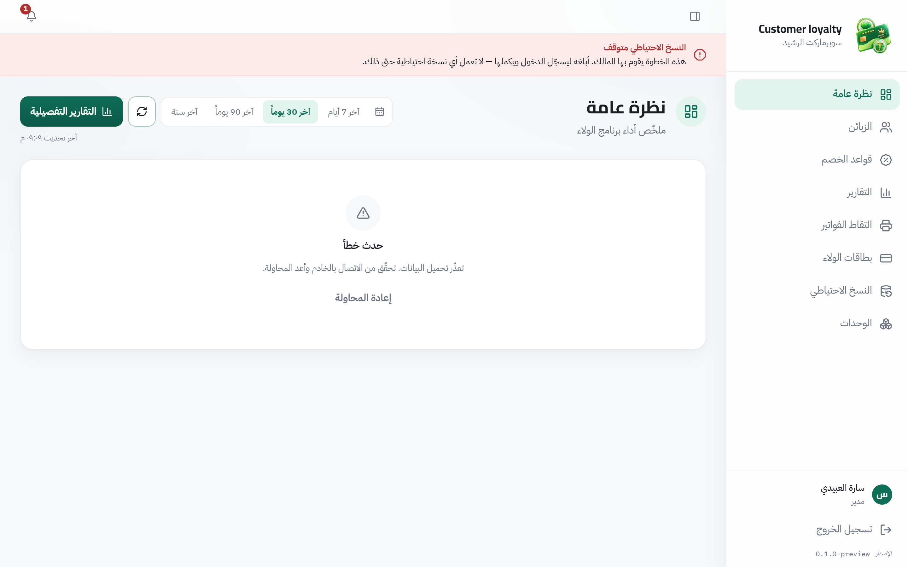

Produced by failing the request.

**Unresolved** — **this is a weak frame and the weakness is in the product.** One query
backs the whole screen, so the error replaces everything: a single 400 px card with a
short sentence floating in 1088 px of width, and 900 px of blank page beneath it. It is
correct (nine identical error cards would be worse) and it looks like the app broke
rather than the connection.

### `state-focus-ring-1440.png`

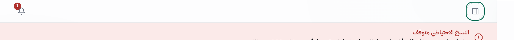

Keyboard focus on «آخر 7 أيام» — 2 px accent ring with a canvas offset.

**This frame caught a harness bug worth naming:** the first version pressed Tab six
times and clipped to the header, and contained no ring at all — under RTL the rail is
the first column and six tabs were still inside it. It now tabs until focus is inside
`<main>` and frames whatever holds it.

---

## Regression check — the three shared tokens

I changed three tokens in `packages/config/tailwind/preset.cjs`, which every screen
inherits:

| Token | Change | Consequence elsewhere |
|---|---|---|
| `fontSize.stat` | new; replaces inline `text-[1.75rem]` → **2 rem** | Reports' four KPI values render 14% larger |
| `borderRadius.card` | new; **same 20 px** the `Card` component hardcoded | none — identical value |
| `spacing.rail-collapsed` | new; **76 px**, used only below `xl` | none above 1280 |

### `reports-full-1440.png`

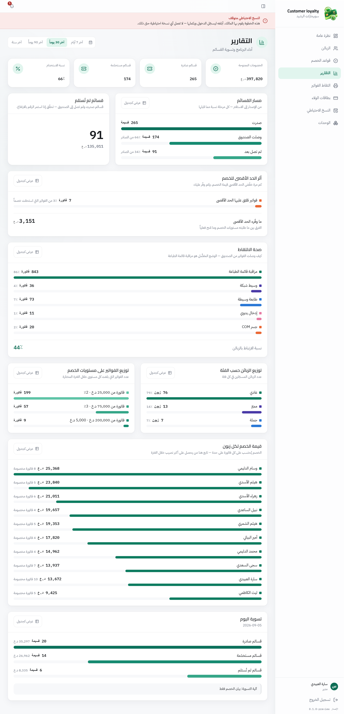

**No regression found.** The four tiles carry the larger figure without overflow or
wrapping (`scrollWidth === clientWidth` on every `.amount`), and Reports now matches
Overview's headline weight, which is the point of naming the token. Vocabulary fix
visible: «توزيع الفواتير على **مستويات** الخصم».

**Pre-existing problems this frame exposes** — and **both of my original claims were
wrong**, corrected here after checking them properly:

- **«تسوية اليوم»: not a skeleton beside an empty message.** It is one composed empty
  state (`EmptyChart`) whose ghost rules happen to look almost exactly like the loading
  skeleton directly above them in the same component — they differed only by a shimmer,
  which does not exist in a still frame. So the *defect* is real and the *description*
  was not. Fixed: the ghost rules are dashed outlines now, which read as "a bar could be
  here and there isn't" rather than "a bar is being drawn".
- **«أثر الحد الأقصى للخصم» does NOT draw a full-width bar.** `CapImpact` already passes
  `scaleTo`, and the bar renders at **7.1%** — verified against the API
  (`cappedDiscountCount 1 / discountedTransactionCount 14 = 7.1%`), not by eye. Under
  RTL the bar fills from the right, and in a downscaled PNG I read the empty *track* as
  the bar. No code change; the claim is withdrawn.

### `customers-fold-1440.png` · `cards-fold-1440.png` · `discounts-fold-1440.png`

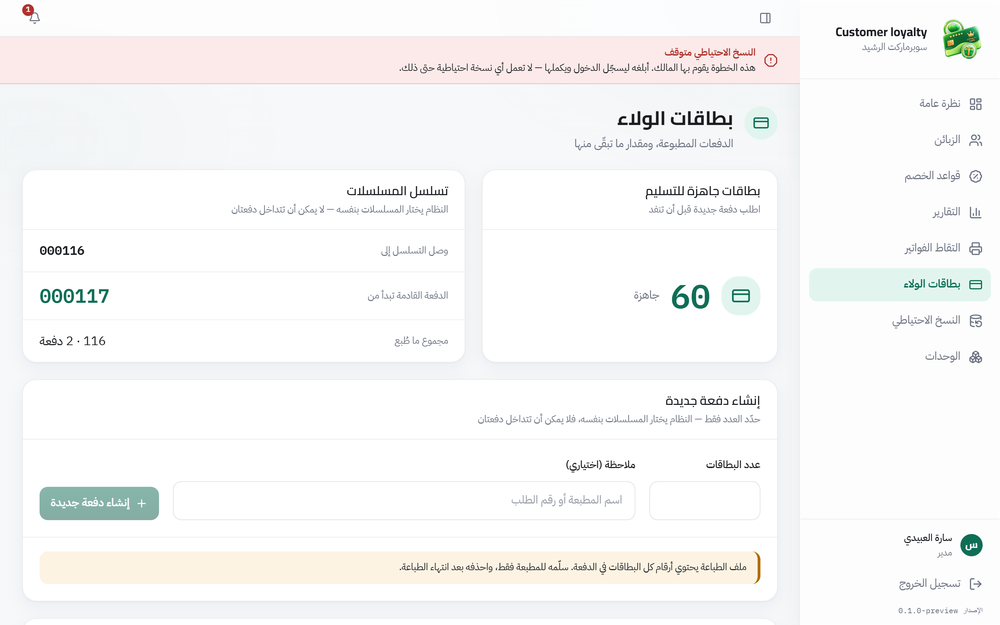
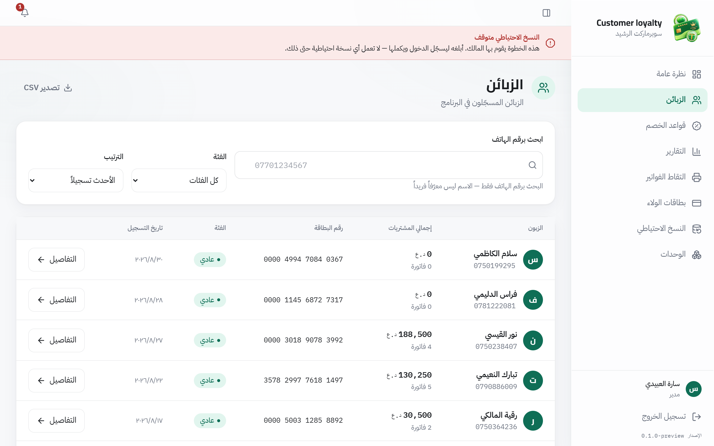
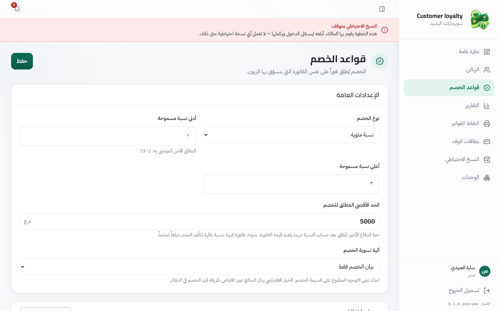

No regression on any of the three. All were already built on the same tokens and
primitives, so the design-language gap you were expecting between the rebuilt Overview
and the rest of the app does not exist — every screen scores zero on a sweep for
hardcoded hex, arbitrary radii and arbitrary type sizes. The Cards frame also confirms
the nav rename: rail and page title now both read «بطاقات الولاء».

---

## Cross-cutting issues, ranked

1. **The temporary build stamp ships in the rail** on every screen. Remove before
   distribution.
2. **Digit systems are split three ways**: Latin for money and counts, Arabic-Indic for
   dates and the last-updated time, raw ISO on the chart axis. The third one is
   indefensible; the first two are a convention worth stating or dropping.
3. **`mt-auto` on the KPI footer** trades intra-row alignment for dead space, and the
   trade is bad below 1280.
4. **Sparkline width is fixed at 96 px** rather than fluid.
5. **The dual-series capture chart** wants a different mark for a spiky count series.
6. **Arabic initial-monograms** do not disambiguate customers.
