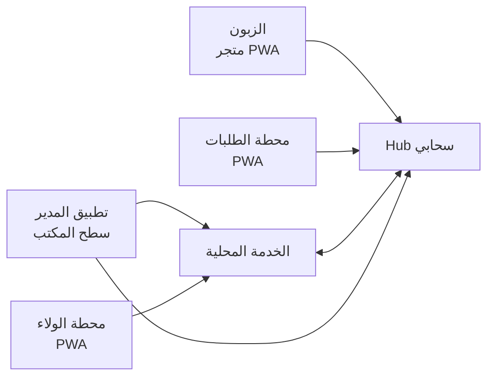
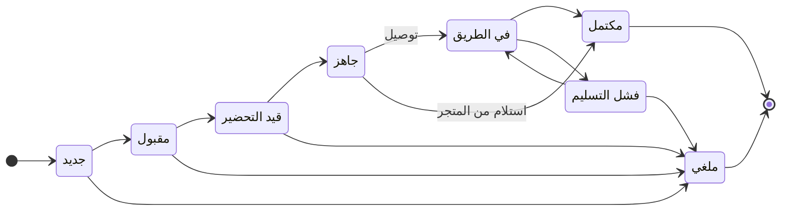
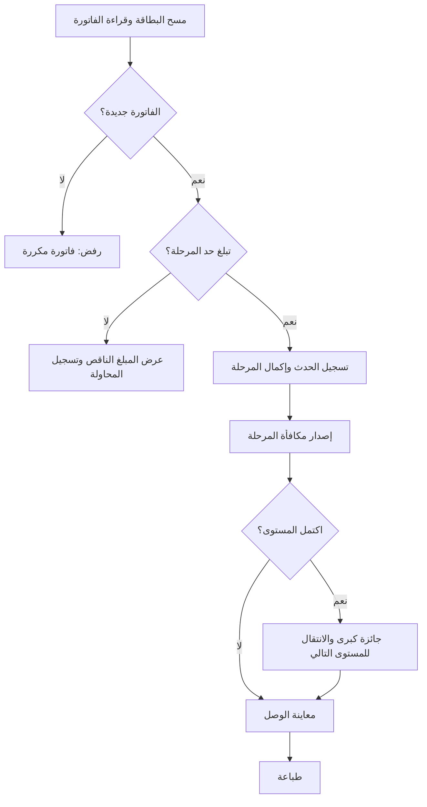

# PRD — ولاء برو (اسم مؤقت): منصة الولاء والمتجر الإلكتروني وإدارة الطلبات

2026-09-20 · @Someone

## 1. الملخص التنفيذي والرؤية

ولاء برو نسخة مستقلة من «ولاء» تحوّل نظام الخصم إلى منصة متكاملة لمتجر التجزئة: رحلة ولاء متصاعدة، وكتالوج منتجات، ومتجر إلكتروني يُفتح بمسح QR، ومحطة طلبات لحظية للموظفين، وكل ذلك قابل للتخصيص من المدير دون برمجة.

**المشكلة.** النسخة الحالية تمنح خصماً على الفاتورة الحالية عند بلوغ حد إنفاق. هذا لا يعطي الزبون سبباً واضحاً للعودة، ولا يعرف المنتجات، ولا يوفر قناة مباشرة بين الزبون والمتجر.

**الرؤية.** رفع معدل عودة الزبائن وحجم السلة عبر مكافآت مرحلية تتصاعد، وفتح قناة طلب مباشرة، وتوحيد إدارة ذلك كله في تطبيق واحد يتحكم فيه المدير.

**ما الذي يتغير**

| المجال | النسخة الحالية | ولاء برو |
| --- | --- | --- |
| الخصم | خصم على الفاتورة الحالية عند بلوغ حد إنفاق | رحلة مستويات ومراحل بمكافآت متنوعة وجوائز كبرى متصاعدة؛ الخصم الفوري أحد أنواع المكافآت |
| المنتجات | غير موجودة | كتالوج وأقسام واستيراد ذكي ومخزون اختياري |
| قناة الزبون | بطاقة باركود ووصل خصم مطبوع | متجر إلكتروني عبر QR مطبوع على الوصل والبطاقة |
| الطلبات | غير موجودة | محطة طلبات لحظية ودردشة وتتبع |
| البطاقة | باركود عضوية يُطبع من المحطة | تصميم يرفعه المدير، ودفعات أرقام للمطبعة، وحزمة شعار |
| البنية | خدمة محلية على جهاز المتجر | خدمة محلية + Hub سحابي |
| التخصيص | إعدادات الخصم وتفعيل الوحدات | أغلب التفاصيل بيانات يعدّلها المدير |

**القيود الحاكمة**

- النسخة الحالية لا تُعدَّل ولا تُحدَّث؛ ولاء برو يُبنى على نسخة منفصلة (القسم 5).
- أغلب التفاصيل تُخزَّن كإعدادات يعدّلها المدير (القسم 4 والملحق أ).
- يعمل النظام دون تكامل مع برنامج الكاشير؛ مسح الباركود والوصل هو الأساس، والتكاملات المحاسبية اختيارية لاحقاً.
- الكاشير لا يعدّل الفاتورة في البيان، لذا تُطبَّق المكافآت عبر وصل أو قسيمة لا بتعديل الفاتورة.
- واجهات المحطات بسيطة للمشغّل، وكل التعقيد للمدير وحده.

حالة المستند: مسودة أولى، والاسم «ولاء برو» مؤقت إلى أن يُحسم في القسم 22.

## 2. الأهداف وغير الأهداف ومقاييس النجاح

النجاح يعني زيادة عودة الزبائن وحجم السلة وتحويل جزء من الطلبات إلى القناة الإلكترونية، دون أن تتجاوز تكلفة المكافآت السقف الذي يحدده المدير.

**الأهداف**

- G1: رحلة ولاء مرحلية قابلة للضبط بالكامل، بمستويات وجوائز تتصاعد.
- G2: كتالوج منتجات يُبنى بسرعة بالاستيراد ويُدار بسهولة.
- G3: متجر إلكتروني سريع يُفتح بمسح QR ويستقبل طلباً كاملاً بموقع الزبون.
- G4: محطة طلبات لحظية وموثوقة للموظفين.
- G5: تخصيص أغلب التفاصيل من المدير دون برمجة.
- G6: نسخة مستقلة كلياً عن الحالية وقابلة للبيع كباقات وحدات.

**غير الأهداف في الإصدار الأول**

- استبدال البيان أو أي نظام محاسبة.
- نظام نقاط كعملة؛ الرحلة تحل محله.
- استثناء أقسام أو أصناف من احتساب المراحل (غير مطلوب حالياً).
- بوابات دفع إلكتروني؛ الدفع عند الاستلام كبداية.
- تطبيق أصلي للزبون؛ المتجر بصيغة PWA يكفي.
- واجهات تعدد الفروع (البنية تحمل معرّف الفرع من البداية، والواجهات لاحقاً).
- تتبع السائق عبر GPS مباشر.

**مقاييس النجاح المقترحة.** الأهداف الرقمية مقترحة وتُراجع بعد قياس خط الأساس في المتجر.

| المقياس | الهدف المقترح | طريقة القياس |
| --- | --- | --- |
| زمن ظهور المتجر (LCP) على شبكة 4G | ≤ 2.5 ثانية | Lighthouse وقياس على أجهزة حقيقية |
| وصول الطلب إلى محطة الموظفين | ≤ 2 ثانية (p95) | فرق التوقيت على الخادم |
| متوسط زمن قبول الطلب | ≤ 60 ثانية | بيانات الطلبات |
| معدل عودة الزبائن خلال 30 يوماً | أعلى من خط الأساس قبل الإطلاق | تقرير الرحلة |
| تكلفة المكافآت ÷ مشتريات المشاركين | ≤ سقف المدير | حاسبة التكلفة والتقرير |
| دقة الاستيراد من Excel منظّم | ≥ 95% من الصفوف دون تدخل | مجموعة ملفات اختبار حقيقية |
| طلبات مفقودة | 0 | اختبارات الموثوقية |

## 3. المستخدمون والأدوار

ستة أدوار تشغّل المنصة، ولكل دور واجهة وصلاحيات مستقلة، ويستطيع المدير تعديل الصلاحيات وإنشاء أدوار جديدة.

| الدور | الواجهة | المهام الرئيسية | الصلاحيات الافتراضية |
| --- | --- | --- | --- |
| المدير | تطبيق سطح المكتب | الإعدادات والمنتجات والرحلة والتقارير وإنشاء المحطات والموظفين | كل شيء داخل متجره |
| مشغّل محطة الولاء | محطة الولاء (متصفح أو PWA) | تسجيل الزبائن، مسح البطاقة والفاتورة، معاينة الوصل وطباعته | عمليات الولاء فقط، بلا إعدادات |
| موظف الطلبات | محطة الطلبات (PWA) | استلام الطلبات وتحضيرها والدردشة وتغيير الحالة | الطلبات فقط |
| السائق (اختياري) | محطة الطلبات بعرض مبسّط | طلباته، فتح الموقع، تأكيد التسليم | طلباته فقط |
| الزبون | المتجر الإلكتروني (PWA) عبر QR | التصفح والسلة والطلب والتتبع والدردشة ورحلتي | بلا حساب إلزامي |
| مالك المنتج (البائع) | لوحة المالك على الـHub | إدارة التجار والباقات والتراخيص وإيقاف حساب غير مدفوع | خارج نطاق التاجر |

**قواعد الأدوار**

- أقل امتياز: كل دور يرى ما يحتاجه فقط.
- لكل موظف PIN خاص وحساب قابل للإيقاف في أي لحظة.
- المصفوفة مخصصة: يحدد المدير لكل دور صلاحيات العرض والإضافة والتعديل والحذف لكل وحدة، إضافة إلى صلاحيات خاصة مثل تعديل السعر ومنح مكافأة يدوياً وإلغاء طلب وعرض التقارير وتصدير البيانات.
- تُسجَّل كل عملية حساسة باسم فاعلها في سجل التدقيق.
- الزبون لا ينشئ حساباً؛ يُعرَّف برمز بطاقته الشخصي أو برقم هاتفه.
- لوحة المالك تبدأ بالحد الأدنى: قائمة التجار، تفعيل الوحدات، مدة التجربة، إيقاف الحساب وتفعيله.

## 4. مبدأ التصميم: كل شيء قابل للتخصيص

القاعدة: أي قيمة أو نص أو ترتيب أو قاعدة عمل قد يريدها تاجران بشكل مختلف تُخزَّن كإعداد في قاعدة البيانات لا في الكود، ويعدّلها المدير من واجهة دون برمجة.

**اختبار القبول لأي متطلب جديد.** لا يُعتمد المتطلب إلا إذا رُفقت به قائمة إعداداته: القيمة الافتراضية، والحدان الأدنى والأعلى، ومن يملك صلاحية تعديله.

**آلية الإعدادات**

1. الطبقات: افتراضات النظام ← إعدادات التاجر ← إعدادات المحطة، والأدنى يتجاوز الأعلى. تُضاف طبقة الفرع لاحقاً دون تغيير البنية.
2. مخطط لكل إعداد (النوع، الحدود، الافتراضي، الوصف، النطاق) تُولَّد منه شاشات التحرير والتحقق، فلا تُكتب شاشة يدوية لكل إعداد.
3. مسودة ثم معاينة ثم نشر: لا يسري التعديل إلا بعد «نشر»، مع معاينة حية للمتجر والوصل والبطاقة والرحلة وإمكانية الرجوع إلى إصدار سابق.
4. سجل تدقيق: من غيّر ماذا ومتى، بالقيمة القديمة والجديدة.
5. تصدير الإعدادات واستيرادها كملف JSON لنسخها بين المتاجر أو استعادتها.
6. قوالب بداية جاهزة لأنواع المتاجر (سوبر ماركت، بقالة، مخبز) تضبط الأقسام والرحلة والوصل بقيم ابتدائية.
7. feature flags لكل تاجر لتفعيل الوحدات وتعطيلها، وهي أساس بيع الوحدات كباقات.
8. حواجز أمان: حد أدنى وأعلى لكل إعداد حساس (نسبة الخصم، مدة الصلاحية، سقف التكلفة) لمنع أخطاء الإدخال.

**خطوط حمراء لا تُخصَّص**

- سلامة سجل أحداث الولاء وعدم قابليته للتعديل.
- عزل بيانات التجار عن بعضهم.
- الحد الأدنى لأمان PIN وكلمات المرور ومدد الرموز.
- منطق آلة حالات الطلب؛ تُخصَّص أسماء الحالات وألوانها وإخفاء غير المستخدم منها، لا انتقالاتها.

**مجالات التخصيص.** الهوية البصرية واللغة والنصوص؛ الأقسام والمنتجات؛ المتجر (التبويبات والعروض والتوصيل وساعات العمل)؛ الطلبات (الحالات والردود الجاهزة والأصوات)؛ الوصل والبطاقة؛ الرحلة بكل قواعدها؛ الصلاحيات؛ الإشعارات؛ التقارير؛ النسخ الاحتياطي. القائمة الكاملة في الملحق أ.

## 5. عزل النسخة الجديدة عن الحالية

النسخة الحالية تُجمَّد كما هي، وولاء برو يبدأ من نسخة كاملة للشيفرة والوثائق في مستودع جديد، بمعرّفات ومنافذ وخدمات وبيانات مختلفة تماماً لا تتقاطع مع الحالية.

**مبادئ العزل**

1. النسخة الحالية للقراءة فقط: لا commit ولا تعديل ولا تحديث فيها.
2. مستودع جديد مستقل، لا فرع (branch) داخل المستودع الحالي.
3. لا موارد مشتركة وقت التشغيل: قاعدة البيانات، المنفذ، خدمة Windows، مجلد البيانات، حساب Google، مفتاح توقيع التحديثات.
4. الاتجاه واحد: من الحالية إلى الجديدة فقط. أي استيراد بيانات يقرأ من نسخة من الملف ولا يكتب في الأصل.
5. التعايش: يمكن تثبيت النسختين على الجهاز نفسه وتشغيلهما معاً دون تعارض.

**خطوات النسخ**

1. خذ نسخة احتياطية كاملة من الحالية: الشيفرة، ونسخة من قاعدة البيانات للاختبار فقط، والمثبّت، والوثائق وقرارات التصميم ومصفوفة القبول.
2. ضع وسماً (tag) على آخر إصدار مستقر في المستودع الحالي، دون أي تعديل آخر.
3. استنسخ المستودع إلى مجلد جديد ثم افصل الرابط الأصلي حتى يستحيل الدفع (push) إلى القديم عن غير قصد.
4. نفّذ قائمة إعادة التسمية أدناه في التزام (commit) أول واحد، ثم شغّل كل الاختبارات الموروثة للتأكد أنها تنجح بالاسم والمنفذ الجديدين.
5. انسخ الوثائق القديمة إلى مجلد docs/legacy للقراءة فقط.
6. فعّل حارس المنشأ (provenance) في الجديدة بحيث ترفض فتح ملف قاعدة بيانات النسخة الحالية، بنفس آلية عزل الديمو عن الإنتاج.
7. اختبر التعايش: ثبّت النسختين، شغّلهما معاً، أزل إحداهما، وتأكد أن الأخرى تعمل.

أوامر الخطوة 3:

```bash
git clone --no-hardlinks <مسار-المستودع-الحالي> walaa-pro
cd walaa-pro
git remote remove origin
git remote add origin <رابط-المستودع-الجديد>
```

**قائمة المعرّفات المطلوب تغييرها**

| العنصر | القيمة الحالية | المطلوب في ولاء برو |
| --- | --- | --- |
| اسم المنتج وعناوين النوافذ | «ولاء» | «ولاء برو» أو الاسم النهائي في كل النصوص |
| معرّف حزمة Tauri (bundle identifier) | اقرأه من ملف الإعداد | معرّف جديد فريد، تُشتق منه مسارات AppData |
| أسماء الحزم (Cargo وnpm) | اقرأها من الشيفرة | بادئة walaa-pro |
| خدمة Windows (الاسم واسم العرض) | اقرأه من الشيفرة | اسم جديد مختلف |
| المنفذ المحلي | 4000 | منفذ آخر، مثلاً 4100، قابل للضبط، مع قاعدة جدار ناري باسم جديد |
| ملف قاعدة البيانات | walaa.db (والديمو walaa-demo.db) | walaa-pro.db (والديمو walaa-pro-demo.db) |
| مجلد البيانات والسجلات | مسار الحالية | مسار جديد تحت اسم المنتج الجديد |
| المثبّت (NSIS): الاسم، مفتاح الإزالة في السجل، مجلد التثبيت، الاختصارات | ولاء\_0.2.0\_x64-setup.exe | معرّف منتج جديد حتى لا يستبدل أحدهما الآخر |
| التحديث التلقائي | بلا مفتاح توقيع حالياً، والتحديث يدوي | مفتاح توقيع جديد ونقطة تحديث جديدة منذ البداية |
| Google OAuth ومجلد Drive | العميل غير مُعدّ بعد | عميل ومجلد جديدان |
| PWA للمحطات (id وscope وstart\_url وأسماء الكاش) | من الشيفرة | قيم مختلفة كلياً |
| أسماء الكوكيز والتخزين المحلي | من الشيفرة | بادئة جديدة؛ الكوكيز لا تُعزل بالمنفذ على المضيف نفسه |
| الأيقونات والشعارات | الحالية | جديدة |
| الدومين والـHub | غير موجودين | دومين خاص بالمنتج الجديد |

**سياسة الإصدارات والصيانة**

- خط إصدارات جديد يبدأ من 0.1.0 وقناة تحديث منفصلة.
- الحالية تبقى على خطها ولا تُحدَّث من الجديد. الإصلاح الحرج فيها يُنقل يدوياً بقرار واعٍ، بلا دمج تلقائي.
- لا مكتبات مشتركة بين المستودعين في البداية؛ إن لزم لاحقاً تُستخرج مكتبة مشتركة بقرار مستقل.
- لا تُشغَّل ولاء برو على بيانات إنتاج قبل اجتياز مصفوفة القبول (القسم 20).

**ترحيل البيانات (اختياري، بعد المرحلة 4).** أداة أحادية الاتجاه تقرأ من نسخة من قاعدة الحالية وتنقل الزبائن والبطاقات والقسائم والسجل إلى هيكل الرحلة الجديد. تُبنى بعد استقرار الرحلة لأن هيكلها يتغير، ولا تعمل على الملف الحي أبداً.

**مكوّنات موروثة دون تغيير في الإصدار الأول.** آلية قراءة الفاتورة كما هي في الحالية (طرق القراءة وما يتصل بها من وكيل الالتقاط)، وحمايات عدم تكرار الفاتورة وعدم الاسترداد المزدوج، والنسخ الاحتياطي عبر Google Drive، وعزل الديمو عن الإنتاج بحارس المنشأ. تنتقل معها اختباراتها، وأي تغيير عليها لاحقاً يمر بقرار مستقل.

## 6. المعمارية

البنية هجينة: خدمة محلية على جهاز المتجر تدير الكاشير والولاء، وHub سحابي يستضيف المتجر والطلبات والدردشة، والجهاز المحلي هو الطرف المبادِر بالاتصال دائماً فلا حاجة لفتح منافذ في الراوتر.



الزبون وموظفو الطلبات يتصلون بالـHub، والمدير ومحطة الولاء بالخدمة المحلية، والخدمة المحلية تتزامن مع الـHub.

**مصدر الحقيقة لكل كيان.** لكل كيان مصدر واحد يكتب فيه، والباقي نسخ للقراءة، وبذلك تنتفي تعارضات الكتابة.

| الكيان | المصدر | النسخة الأخرى |
| --- | --- | --- |
| الزبائن والبطاقات | الخدمة المحلية | نسخة قراءة على الـHub: الاسم، الهاتف المطبّع، رمز البطاقة، ملخص الرحلة |
| الرحلة والقسائم وسجل الأحداث | الخدمة المحلية | لقطة عرض للقراءة على الـHub لتغذية «رحلتي» |
| المنتجات والأقسام والصور والعروض | الـHub | تخزين مؤقت للقراءة في الخدمة المحلية |
| الطلبات والدردشة والتتبع | الـHub | حدث «مكتمل» يُسحب إلى المحلية ليُحتسب في الرحلة |
| إعدادات الولاء والكاشير والوصل | الخدمة المحلية | نسخة على الـHub لعرض ما يخص الزبون |
| إعدادات المتجر والطلبات والكتالوج | الـHub | تخزين مؤقت محلي |
| الترخيص والباقات | الـHub | تخزين مؤقت محلي مع مهلة سماح دون إنترنت |

**قواعد المزامنة**

1. لكل طرف سجل أحداث صادرة وواردة، ولكل حدث معرّف فريد، والاستقبال آمن من التكرار (idempotent).
2. الترتيب مضمون لكل كيان، وإعادة المحاولة بتراجع تصاعدي عند الفشل.
3. الجهاز المحلي هو من يبدأ الاتصال (WebSocket مع استعلام احتياطي)، فلا منافذ واردة.
4. دون إنترنت: الكاشير والولاء يعملان كاملين محلياً ويتزامنان عند العودة. والمتجر والطلبات لا يتأثران بتوقف الجهاز المحلي، إذ تنتظر الأحداث في الـHub حتى يسحبها.
5. ربط الهوية: يُطابَق زبون المتجر (ضيف) مع زبون الولاء برقم الهاتف بعد التطبيع؛ عند التطابق تُربط سجلاته، وإلا يبقى ضيفاً حتى يُسجَّل في المحطة.
6. حالة المزامنة ظاهرة للمدير: آخر مزامنة، عدد الأحداث المعلقة، والأخطاء.

**التقنيات المقترحة.** قابلة للتبديل بقرار موثّق.

| الطبقة | المقترح | ملاحظة |
| --- | --- | --- |
| الخدمة المحلية | الحالية (Rust وSQLite) | تبقى مصدر حقيقة الولاء |
| الـHub | Rust (Axum) أو Node.js، مع PostgreSQL | عزل التجار بمعرّف tenant في كل جدول |
| الصور والملفات | تخزين كائنات متوافق مع S3 مع CDN | أحجام متعددة بصيغة WebP |
| اللحظي | WebSocket، وتوزيع الأحداث عبر PostgreSQL أو Redis | استعلام احتياطي عند الانقطاع |
| واجهات الويب | React وVite بصيغة PWA (service worker وmanifest) | توحيدها مع محطة الولاء الحالية إن أمكن |
| الخرائط | Leaflet مع OpenStreetMap | مجاني للبداية وقابل للاستبدال بمزود خرائط |
| الإشعارات | Web Push (VAPID) وبوت Telegram | وروابط واتساب (wa.me) يفتحها الموظف |
| قراءة PDF والصور | خدمة على الـHub تستدعي نموذج رؤية | المفتاح على الخادم فقط |
| محرك الرحلة | وحدة مستقلة قابلة للاختبار بمعزل عن الواجهة وقاعدة البيانات | أساس الاختبارات الخصائصية |

## 7. الأساس: الحسابات والصلاحيات والمحطات والإعدادات

الأساس يوفّر ما تعتمد عليه بقية الوحدات: حسابات وأدوار، وإنشاء المحطات، ومحرك الإعدادات، وتفعيل الوحدات لكل تاجر، وسجل تدقيق، ونسخ احتياطي.

| المعرّف | المتطلب | ما يخصصه المدير |
| --- | --- | --- |
| FND-01 | حسابات الموظفين: اسم، PIN مخزَّن مجزّأً (hash)، دور، حالة، وقفل مؤقت بعد محاولات خاطئة | طول PIN، عدد المحاولات، مدة القفل |
| FND-02 | أدوار مخصصة بمصفوفة صلاحيات لكل وحدة، وصلاحيات خاصة (تعديل السعر، منح مكافأة يدوياً، إلغاء طلب، التقارير، التصدير) | إنشاء الأدوار وتعديلها |
| FND-03 | إنشاء المحطات: نوعها (ولاء أو طلبات)، اسم، رابط وQR للربط بجهاز، رمز جهاز يُبطَل من لوحة المدير، PWA قابلة للتثبيت | الاسم، الشعار والألوان، الأعمدة والعناصر الظاهرة، الأصوات، ساعات التشغيل |
| FND-04 | محرك الإعدادات بالطبقات والمخطط والمسودة والنشر والتراجع وفق القسم 4 | كل الإعدادات (الملحق أ) |
| FND-05 | feature flags لكل تاجر: products وinventory وstorefront وorders وjourney وcard\_designer وanalytics وchat وoffers وtelegram | تفعيل الوحدات وتعطيلها (المالك أو المدير حسب الباقة) |
| FND-06 | سجل تدقيق لكل تغيير حساس مع الفاعل والوقت والقيمة القديمة والجديدة | مدة الاحتفاظ |
| FND-07 | اللغة والتنسيق: RTL كامل، العربية أساس، دينار عراقي بلا كسور، منطقة زمنية Asia/Baghdad وساعة بدء اليوم | اللغة، صيغة الأرقام، ساعة قطع اليوم |
| FND-08 | النسخ الاحتياطي: Google Drive للخدمة المحلية (موروث)، ونسخ يومي للـHub مع استعادة موثّقة ومجرَّبة | الجدولة والوجهة |
| FND-09 | صفحة صحة النظام: اتصال الـHub، آخر مزامنة، الأحداث المعلقة، حالة الطابعة والماسح، المساحة المتبقية | حدود التنبيه |
| FND-10 | الترخيص وفق خطة البيع: فترة تجربة ثم اشتراك مدفوع، وإيقاف تثبيت غير مدفوع عن بُعد مع مهلة سماح دون إنترنت | مدة التجربة والسماح (بيد المالك) |

**معايير القبول**

- إنشاء محطة وتثبيتها على جهاز جديد خلال 3 دقائق دون تدخل تقني.
- إبطال رمز جهاز يوقف المحطة خلال دقيقة.
- كل تغيير إعداد يظهر في سجل التدقيق، والتراجع إلى إصدار سابق يعيد السلوك السابق.
- تعطيل feature flag يخفي الوحدة من كل الواجهات ويرفض طلباتها على الخادم.
- لا يستطيع دور تنفيذ عملية خارج صلاحياته حتى بطلب API مباشر.

## 8. المنتجات والأقسام

كتالوج واحد يغذّي المتجر والطلبات والتقارير، ويديره المدير بالكامل، وحذف المنتج يكون أرشفة لا محواً حتى لا تنكسر الطلبات القديمة.

**حقول المنتج**

| الحقل | النوع | ملاحظة |
| --- | --- | --- |
| الاسم بالعربية | نص، إلزامي | الاسم بالإنجليزية اختياري |
| الباركود | نص، فريد لكل تاجر | اختياري لكنه موصى به، وهو أساس مطابقة الاستيراد |
| القسم | مرجع، إلزامي | المنتج بلا قسم يذهب إلى «غير مصنّف» |
| السعر | عدد صحيح بالدينار، إلزامي | بلا كسور |
| سعر التكلفة | عدد صحيح، اختياري | لحساب الربح |
| الوحدة وخطوة الكمية | قائمة | قطعة، كغم، جرام، كرتون، أو وحدة يضيفها المدير؛ الخطوة 1 أو 0.5 أو 0.25 |
| حدا الكمية في الطلب | أرقام، اختيارية | أدنى وأقصى |
| الصور | حتى عدد يحدده المدير | الأولى رئيسية |
| الوصف والوسوم | نص | للبحث والعرض |
| الحالة | متوفر، مخفي، نفد، مؤرشف | «نفد» يُظهر المنتج بشارة |
| الكمية وحد التنبيه | أرقام، اختيارية | القسم 10 |
| تاريخ الانتهاء والمورّد | اختياري | القسم 10 |
| سعر العرض ونافذته الزمنية | رقم وتاريخان | يظهر السعر القديم مشطوباً |
| مميز | نعم أو لا | يظهر في تبويب «مميز» |
| حقول مخصصة | يعرّفها المدير | مثل بلد المنشأ أو الوزن |

**الأقسام.** شجرة بمستويين: الاسم، أيقونة، صورة غلاف، لون، ترتيب بالسحب، إظهار أو إخفاء، وجدولة ظهور (مثل «عروض رمضان»). أقسام تلقائية اختيارية: العروض، الأكثر طلباً، جديد.

**العمليات**

- إضافة وتعديل وأرشفة واستعادة، وحذف نهائي لمنتج لا يرتبط بطلب فقط.
- نسخ منتج.
- تعديل جماعي: السعر بنسبة أو مبلغ، نقل قسم، إخفاء، تغيير وحدة.
- بحث وفلاتر: القسم، الحالة، بلا صورة، بلا باركود، منخفض المخزون.
- سجل تغيّر الأسعار لكل منتج.
- تصدير Excel وCSV.

**معايير القبول**

- منتج جديد بصورته يظهر في المتجر خلال 5 ثوانٍ من الحفظ.
- تعديل جماعي لـ 500 منتج خلال 10 ثوانٍ.
- أرشفة منتج لا تغيّر أي طلب سابق يحتويه، لأن الطلب يحتفظ بلقطة من الاسم والسعر وقت الطلب.
- الباركود المكرر يُرفض برسالة تبيّن المنتج المتعارض.

## 9. الاستيراد الذكي

الاستيراد يمر دائماً بثلاث مراحل: قراءة ثم مراجعة ثم اعتماد، ولا يُكتب شيء في الكتالوج قبل موافقة المدير.

**المصادر المدعومة.** Excel (xlsx وxls)، وCSV، وPDF نصي، وPDF أو صورة ممسوحة ضوئياً، وصور المنتجات.


الاستخراج تحليل مباشر لـExcel وCSV وPDF النصي، وقراءة بنموذج رؤية (OCR أو ذكاء اصطناعي) للملف الممسوح ضوئياً.

**قواعد المطابقة**

1. بالباركود أولاً؛ إن وُجد يُحدَّث المنتج بدل تكراره.
2. ثم باسم مطابق تماماً بعد التطبيع (توحيد الهمزات وإزالة التشكيل والمسافات الزائدة).
3. ثم باسم مشابه يُعرض كاقتراح للمدير لا كقرار تلقائي.

**التحقق.** يُصنَّف كل صف: جديد، تحديث، تعارض، خطأ. ومن الأخطاء والتحذيرات المكتشفة: سعر مفقود أو غير رقمي، وباركود مكرر داخل الملف، ووحدة غير معروفة، وقسم غير موجود (مع خيار إنشائه)، وتغيّر سعر يتجاوز نسبة يحددها المدير.

**الثقة.** لكل حقل يستخرجه الذكاء الاصطناعي درجة ثقة، وما دون الحد الذي يضعه المدير يُعلَّم «يحتاج مراجعة» وتقف عنده شاشة المراجعة.

**التراجع.** لكل استيراد معرّف، ويمكن التراجع عنه كاملاً خلال مدة يحددها المدير. يُعاد كل منتج إلى حالته السابقة ما لم يُعدَّل يدوياً بعد ذلك، وتُعرض الاستثناءات.

**الصور**

- رفع جماعي (ملفات متعددة أو ZIP) وربط تلقائي باسم الملف: الباركود أو الرمز أو اسم المنتج.
- تحويل إلى WebP بأحجام مصغّر ومتوسط وكبير، مع ضغط وإزالة بيانات EXIF.
- رفض أي ملف ليس صورة فعلاً.

**قالب CSV نموذجي**

```csv
barcode,name_ar,category,price,cost,unit,stock,expiry,image_file
6281000123456,حليب طويل الأجل 1 لتر,الألبان والأجبان,1500,1100,قطعة,48,2027-03-01,6281000123456.jpg
```

**ما يخصصه المدير.** قوالب مطابقة أعمدة محفوظة (مثل قالب ملف المنتجات المصدَّر من نظام الكاشير، يُبنى من ملف حقيقي)، وحد تحذير تغيّر السعر، وحد الثقة، وسلوك المكرر (تحديث أو تجاهل أو سؤال)، وإنشاء الأقسام تلقائياً من عمود القسم، ومدة إمكانية التراجع، ومدة الاحتفاظ بملفات الاستيراد.

**الأمان.** التحقق من نوع الملف بمحتواه لا بامتداده، وحد أقصى للحجم، ومعالجة معزولة، ومفتاح الذكاء الاصطناعي على الـHub فقط، ولا تُرسَل بيانات الزبائن إلى النموذج أبداً.

**معايير القبول**

- ملف Excel منظّم من 5,000 صف يصل إلى شاشة المراجعة خلال 60 ثانية.
- ≥ 95% من الصفوف تُقرأ صحيحة دون تدخل على مجموعة ملفات اختبار حقيقية.
- لا يُكتب أي صف في الكتالوج قبل الاعتماد.
- استيراد يُتراجع عنه يعيد الكتالوج إلى حالته السابقة باستثناء ما عُدّل يدوياً.

## 10. المخزون (اختياري)

المخزون وحدة اختيارية مفعّلة بـfeature flag، وافتراضها وضع «إرشادي» تُحدَّث فيه الكميات بالاستيراد، لأن مخزون نظام الكاشير هو المرجع الحقيقي لدى من يستخدمه، وإدخال الكميات يدوياً في مكانين يباعد بين الأرقام مع الوقت.

**وضعان يختار بينهما المدير**

| الجانب | وضع الإرشاد (الافتراضي) | وضع المخزون الكامل |
| --- | --- | --- |
| الكمية | اختيارية، تُحدَّث باستيراد سريع بمطابقة الباركود | تُشتق من الحركات |
| الحركات | لا توجد | إدخال، إخراج، تسوية، تالف، مرتجع، بفاعل وسبب |
| الجرد | لا يوجد | بالباركود عبر ماسح أو كاميرا الهاتف |
| الموردون والشراء | لا يوجدان | موردون وفواتير شراء بسيطة |
| التنبيهات | نقص وانتهاء حسب آخر تحديث | نقص وانتهاء لحظياً |
| المناسب لـ | من يعتمد على نظام كاشير يدير المخزون | من لا يملك نظاماً محاسبياً |

**المتطلبات**

- كل حركة تُسجَّل بالفاعل والوقت والسبب، والرصيد يساوي مجموع الحركات، ولا يُعدَّل الرصيد مباشرة.
- تنبيه نقص عند بلوغ الحد، وتنبيه قرب الانتهاء بالأيام التي يحددها المدير.
- خصم المخزون عند اكتمال الطلب الإلكتروني اختياري.
- إخفاء المنتج تلقائياً عند الصفر اختياري، أو إظهاره بشارة «نفد».
- حجز الكمية عند قبول الطلب اختياري حتى التسليم أو الإلغاء.

**ما يخصصه المدير.** وضع المخزون، وحد النقص الافتراضي ولكل منتج، وأيام تنبيه الانتهاء، والسماح بمخزون سالب، والإخفاء التلقائي عند الصفر، والخصم عند اكتمال الطلب، والحجز عند القبول.

**معايير القبول**

- الرصيد يساوي مجموع الحركات دائماً في اختبار عشوائي لألف حركة.
- جرد 500 صنف بالباركود خلال 15 دقيقة.
- ينشأ تنبيه النقص خلال دقيقة من بلوغ الحد.
- التحديث السريع بالاستيراد يطابق الباركود ولا يمسّ حقولاً أخرى.

## 11. المتجر الإلكتروني

المتجر صفحة ويب عامة سريعة تُفتح بمسح QR مطبوع على الوصل والبطاقة، ويطلب منها الزبون دون حساب، وكل ما يظهر فيها يخصصه المدير.

**الرابط والـQR**

- دومين ثابت للتاجر. الـQR يحمل رابطاً دائماً لا يتغير بعد الطباعة، وأي تغيير في الوجهة يتم بإعادة توجيه من الخادم فلا تحتاج البطاقات إلى إعادة طباعة.
- نوعان من الـQR: عام يطلب الاسم والهاتف مرة واحدة ويحفظهما على الجهاز، وشخصي لكل بطاقة برمز عشوائي (128 بت فأكثر) يعرّف الزبون تلقائياً فتُربط طلباته برحلته.
- يُولَّد الـQR بصيغتي PNG وSVG وبمقاسات مناسبة للوصل والبطاقة.

**الصفحات**

| الصفحة | المحتوى |
| --- | --- |
| الرئيسية | شعار، لافتة ترحيب، حالة الفتح وساعات العمل، بحث |
| الأقسام | تبويبات أفقية ثابتة من أقسام المدير |
| المنتج | صور، سعر، وحدة، وصف، إضافة للسلة |
| السلة | الأصناف، الملاحظات، الإجمالي، رسوم التوصيل |
| إتمام الطلب | بيانات الزبون، الاستلام، الموقع، الدفع |
| تتبع الطلب | الحالة، الدردشة، الموافقة على التعديلات |
| رحلتي | المستوى والمرحلة والقسائم المتاحة وموعد انتهائها (للزبون المعرَّف) |

**التبويبات والمنتجات**

- التبويبات تُبنى من أقسام المدير بترتيبها وإخفائها وجدولتها، مع تبويبات تلقائية اختيارية («العروض» و«الأكثر طلباً» و«جديد»).
- بطاقة المنتج: صورة، اسم، سعر بالدينار بفاصل الآلاف، وحدة، السعر القديم مشطوباً عند العرض، زر إضافة وعدّاد بخطوة الوحدة، وشارة «نفد».
- بحث فوري وفرز وفلتر «المتوفر فقط»، وتحميل كسول للصور.

**السلة والطلب**

- السلة تُحفظ في المتصفح، ولكل صنف ملاحظة. الأصناف الموزونة تُطلب بكمية تقديرية مع عبارة «الوزن النهائي عند التحضير».
- حد أدنى للطلب يحدده المدير.
- السعر النهائي والتوفر يُتحقق منهما على الخادم عند الإرسال، لا في الصفحة.
- بيانات الطلب: الاسم، الهاتف (مطبّع ومتحقق منه)، توصيل أو استلام من المتجر، ملاحظات، طريقة الدفع (عند الاستلام كبداية)، والموافقة على الشروط.

**الموقع: أربع طرق**

1. زر «موقعي الحالي» عبر GPS المتصفح.
2. تحديد نقطة على الخريطة (Leaflet مع OpenStreetMap).
3. لصق رابط Google Maps: يفك الخادم الروابط المختصرة ويستخرج الإحداثيات، وإن تعذّر يُحفظ الرابط كما هو ويظهر للموظف.
4. حقل «أقرب نقطة دالة» النصي، ويمكن للمدير جعله إلزامياً لأن العناوين غالباً تعتمد على المعالم.

**التوصيل والتشغيل**

- مناطق توصيل برسم ثابت أو حسب المسافة، وحد للتوصيل المجاني، ونطاق خدمة يُنبَّه الزبون عند الخروج منه.
- ساعات عمل أسبوعية، وزر «إيقاف الطلبات مؤقتاً»، ورسالة إغلاق مخصصة.
- الهوية: ألوان وخطوط وشعار وغلاف ونصوص من المدير، مع معاينة قبل النشر وقوالب مظهر جاهزة.

**الحماية.** تحديد معدل الطلبات، وتحقق ضد الروبوتات (Cloudflare Turnstile أو ما يماثله)، وحد للطلبات النشطة لكل هاتف، وقائمة حظر أرقام. ولا تُعرض بيانات شخصية لغير صاحب رابط الطلب.

**معايير القبول**

- طلب كامل من مسح QR حتى وصوله إلى محطة الموظفين خلال 90 ثانية لمستخدم جديد.
- الموقع يُسجَّل بإحداثيات صحيحة بكل من الطرق الأربع.
- لا يمكن إرسال طلب لصنف مؤرشف، ولا لصنف نافد إن كان المنع مفعّلاً.
- الـQR المطبوع على وصل حراري وبطاقة حقيقيين يُقرأ بهواتف أندرويد وiPhone.

## 12. الطلبات ومحطة الطلبات والدردشة

كل طلب يُحفظ على الـHub قبل تأكيده للزبون، ويصل إلى محطة الموظفين لحظياً بصوت وإشعار، ويمر بحالات يخصص المدير أسماءها وألوانها.



الحالات الداخلية ثابتة. يعيد المدير تسميتها وتلوينها ويخفي ما لا يحتاجه (مثل دمج «مقبول» مع «قيد التحضير»)، ولا يغيّر انتقالاتها.

**محطة الطلبات**

- تُنشأ من لوحة المدير كمحطة من نوع «طلبات» (القسم 7)، وتُفتح في المتصفح وتُثبَّت على الشاشة الرئيسية كـPWA، مع دخول بـPIN لكل موظف.
- الاتصال اللحظي عبر WebSocket مع إعادة اتصال تلقائية واستعلام احتياطي، ومؤشر اتصال أخضر أو أحمر ظاهر، وتنبيه صوتي عند الانقطاع حتى لا يفوت الموظف طلباً دون أن يعلم.
- الطلب الجديد يُصدر صوتاً متكرراً حتى يقبله موظف (النغمة والتكرار من المدير)، مع إشعار Web Push حين تكون الصفحة في الخلفية، ومنع انطفاء الشاشة (Wake Lock).
- لوحة كانبان بأعمدة الحالات الظاهرة. بطاقة الطلب: الرقم، وقت الانتظار (يتلوّن عند حدود يحددها المدير)، عدد الأصناف، الإجمالي، نوع الاستلام، المسؤول.
- إسناد الطلب لموظف أو سائق، يدوياً أو بالتناوب حسب إعداد المدير.
- طباعة قائمة التحضير على طابعة حرارية.

**تفاصيل الطلب**

- الأصناف بالصور والكميات والملاحظات، وبيانات الزبون، وسجل الحالات.
- الموقع: زر «فتح في Google Maps»، ونسخ الرابط، وخريطة مصغّرة، والنقطة الدالة.
- أزرار اتصال وواتساب (رابط wa.me).

**تعديل الطلب.** صنف غير متوفر، أو بديل، أو وزن وكمية فعلية، أو إضافة صنف. يُعاد حساب الإجمالي، وإن تجاوز الفرق حداً يحدده المدير يُرسَل للزبون طلب موافقة يقبله أو يرفضه من صفحة التتبع.

**الدردشة.** خيط لكل طلب، نصوص وصور (اختيارية)، وردود جاهزة يحددها المدير («طلبك قيد التحضير» مثلاً)، وإشعار بالقراءة، وتعقيم كامل للمدخلات، ومدة احتفاظ يحددها المدير. تظهر للزبون في صفحة التتبع.

**عند الاكتمال.** يُنشأ حدث «بيع مكتمل» بقيمة الأصناف بعد الخصم ودون رسوم التوصيل، ويُرسل إلى الخدمة المحلية ليُحتسب في الرحلة، ويخفض المخزون إن فُعّل ذلك. لا يُحتسب الطلب عند إنشائه.

**الإلغاء.** أسبابه يحددها المدير، ويتطلب الإلغاء بعد القبول صلاحية وسبباً.

**الموثوقية**

- يُحفظ الطلب بمعاملة كاملة قبل الرد على الزبون، ولا يُعرض للزبون نجاح قبل تأكد الحفظ.
- عند عودة اتصال المحطة تُجلب الطلبات الفائتة تلقائياً.
- تنبيه للمدير (Telegram أو داخل التطبيق) إن بقي طلب جديد دون قبول أكثر من مدة يحددها.

**معايير القبول**

- وصول الطلب إلى المحطة خلال ثانيتين (p95).
- اختبار قطع الشبكة وعودتها لا يفقد أي طلب.
- الصوت يتكرر حتى القبول ويتوقف فور قبول أي موظف على أي محطة.
- 50 طلباً متزامناً لا يجعلان زمن الإشعار يتجاوز الحد أعلاه.

## 13. محطة الولاء: معاينة الوصل وعرض البطاقة

المحطة تضيف معاينة حية للوصل قبل طباعته وعرضاً لتصميم البطاقة عند المسح، وتبقى أبسط ما يمكن للمشغّل بينما تُخفى عنه كل الإعدادات.

**سير عمل المشغّل**

1. مسح البطاقة: يظهر الزبون وتصميم بطاقته.
2. مسح الفاتورة أو قراءتها.
3. يظهر الحساب والمكافأة وتقدّم المرحلة.
4. معاينة الوصل.
5. الضغط على «طباعة».

إن لم تبلغ الفاتورة حد المرحلة تظهر رسالة واضحة «ينقصك كذا دينار» وتُسجَّل المحاولة، بدل الرفض الصامت.

**معاينة الوصل**

- لوحة تحاكي الوصل الحراري بعرض 58 أو 80 ملم حسب الطابعة، بالقيم الفعلية: الإجمالي قبل الخصم، الخصم أو المكافأة المطبَّقة، الإجمالي بعده، تقدّم المرحلة، القسائم المُصدَرة، QR المتجر، ونص ختامي.
- زر «طباعة» بارز وزر «إلغاء أو تعديل».
- بعد الضغط على «طباعة» يُرسَل الوصل للطابعة ثم يتلاشى تدريجياً (شفافية وانزلاق خفيف) بمدة يحددها المدير، ثم تُصفَّر الشاشة للزبون التالي. يُحترم إعداد «تقليل الحركة» في النظام.
- إن فشلت الطباعة لا يتلاشى الوصل، وتظهر رسالة «لم تتم الطباعة» مع «إعادة المحاولة»، ولا تُفقد المعاملة.
- قالب واحد يُنتج المعاينة والوصل المطبوع معاً حتى يتطابقا.
- الطباعة الصامتة (دون نافذة الطباعة) تتم عبر الخدمة المحلية (ESC/POS أو طابور الطباعة) أو وضع kiosk-printing في المتصفح، ويختار المدير الطريقة لكل محطة.

**قالب الوصل.** كتل يرتبها المدير: شعار، عنوان، اسم الزبون، الفاتورة، الإجماليات، الخصم، المكافأة، الرحلة، QR، نص حر. لكل كتلة إظهار أو إخفاء ونص وحجم خط، مع معاينة فورية.

**عرض البطاقة عند مسح الباركود**

- يظهر تصميم البطاقة الذي رفعه المدير بحجم كبير مع اسم الزبون ورقم العضوية ومستواه ومرحلته وشريط التقدم والقسائم المتاحة.
- يبقى ظاهراً أثناء العملية ثم ينتقل تلقائياً إلى خطوة الفاتورة؛ مدة العرض وموضع العناصر من المدير.
- إن لم يُرفع تصميم يُستخدم تصميم افتراضي.

**مساندة للمشغّل**

- بحث سريع بالاسم أو الهاتف، وتسجيل زبون جديد بالحد الأدنى (اسم وهاتف).
- إعادة طباعة باركود العضوية، وتفعيل بطاقة من دفعة (القسم 14).
- وضع ملء الشاشة، وأزرار كبيرة للمس، ودعم قارئ الباركود كلوحة مفاتيح.

**ما يخصصه المدير.** ما يظهر للمشغّل، ورسائل الشاشة، وأصوات النجاح والخطأ، ومدة عرض البطاقة، ومدة تلاشي الوصل، وقوالب الوصل، وعرض الورق وطريقة الطباعة، ومدة إعادة الضبط التلقائي للشاشة.

**معايير القبول**

- من مسح البطاقة إلى ظهور الوصل خلال 1.5 ثانية على الشبكة المحلية.
- لا يُطبع أي وصل قبل ضغط «طباعة».
- الوصل المطبوع يطابق المعاينة.
- فشل الطابعة لا يُفقد المعاملة ولا يضاعفها عند الإعادة.

## 14. البطاقات والهوية البصرية

المدير يصمم بطاقته بنفسه: يرفع الخلفية، ويضع الباركود والاسم، ويصدّر ملفاً جاهزاً للمطبعة، ويولّد دفعات أرقام فريدة تُفعَّل عند أول مسح في المحطة.

**مكتبة الهوية**

- يرفع المدير شعار المتجر (SVG أو PNG شفاف بدقة كافية)، ويتوفر شعار التطبيق كملف جاهز.
- التنزيل بصيغ PNG شفاف (ملوّن وأبيض وأسود) وSVG وPDF بدقة طباعة.
- «حزمة المطبعة»: ملف ZIP يضم الشعارات والقالب والألوان (HEX مع قيم CMYK تقريبية) وتوصيف المقاسات، ليضيفها المدير إلى تصميمه عند إرساله للمطبعة.

**مصمم البطاقة**

- رفع صورة أو PDF أو SVG للوجه والظهر.
- وضع العناصر بالسحب: باركود العضوية (Code 128 أو QR حسب الماسح)، ورقم العضوية، والاسم (اختياري)، وQR المتجر على الظهر، والشعار، مع حدود آمنة.
- المقاس الافتراضي CR80 (نحو 85.6×54 ملم) وهامش قص 3 ملم، قابلان للتغيير ويُؤكَّدان مع المطبعة.
- التصدير PDF وPNG بدقة 300 DPI، مع معاينة تطابق ما سيُطبع.

**دفعات البطاقات**

1. يحدد المدير بادئة وعدد البطاقات، فيولّد التطبيق أرقاماً فريدة (بادئة + تسلسل + رقم تحقق).
2. يصدّر ملفاً للمطبعة (CSV وPDF متغير البيانات) لتطبع باركوداً مختلفاً على كل بطاقة.
3. البطاقة «غير مفعّلة» حتى تُمسح أول مرة في المحطة، فيُسجَّل اسم الزبون وهاتفه وتصبح «مفعّلة».
4. حالات البطاقة: غير مفعّلة، مفعّلة، موقوفة، مفقودة. ولا تُفعَّل بطاقة مرتين.
5. البطاقة المفقودة: تُوقَف القديمة وتُصدَر بديلة تحمل الحساب نفسه، فتنتقل رحلة الزبون وقسائمه.

**بديل مطبوع من المحطة.** طباعة باركود العضوية بطابعة صغيرة (السلوك الحالي) تبقى متاحة للزبائن الذين لا بطاقة لديهم.

**ما يخصصه المدير.** التصميم، والمقاس والهامش، ونوع الباركود، وبادئة الأرقام وطولها، وعدد الدفعات، وما يُطبع على الظهر، والحقول المطبوعة، ونمط QR المتجر (عام أو شخصي).

**معايير القبول**

- ملف PDF المُصدَّر بالمقاس والهامش الصحيحين، ويُقرأ باركوده بماسح المتجر 100% في اختبار طباعة فعلي.
- لا أرقام مكررة عبر الدفعات.
- تفعيل البطاقة مرة واحدة فقط، ومحاولة ثانية تُرفض برسالة واضحة.
- رقم التحقق (checksum) يرفض أخطاء الإدخال الشائعة.

## 15. رحلة الولاء: محرك المراحل والجوائز

رحلة الولاء تستبدل الخصم الواحد بسلسلة مستويات ومراحل تكافئ عودة الزبون، وتنتهي كل دورة بجائزة كبرى تليها دورة أكبر، وكل عناصرها يحددها المدير.

**المفاهيم**

| المصطلح | التعريف |
| --- | --- |
| الرحلة | إعداد واحد نشط لكل تاجر (مع مسودات)، يضم المستويات |
| المستوى | دورة من عدد ثابت من المراحل، لها اسم ولون وجائزة كبرى |
| المرحلة | خطوة تكتمل بشرط محدد وتمنح مكافأة |
| المكافأة | ما يُمنح عند إكمال مرحلة |
| الجائزة الكبرى | ما يُمنح عند إكمال المستوى |
| القسيمة | المكافأة القابلة للاسترداد، بتاريخ انتهاء وحالة |
| وصل الهدية | قسيمة لهدية عينية يسلّمها الموظف |
| السجل (Ledger) | سجل أحداث لا يُعدَّل، تُشتق منه حالة الزبون |

**شرط إكمال المرحلة.** نمط الزيارة هو الافتراضي: تكتمل المرحلة بفاتورة واحدة لا تقل عن الحد الأدنى للمرحلة. نمط التراكم بديل: تكتمل المرحلة بمجموع مشتريات خلال نافذة زمنية يتخطى الحد، وهو منطق الخصم التراكمي الحالي. يختار المدير النمط لكل رحلة.

**قواعد الاحتساب**

| القاعدة | الافتراضي | يخصصه المدير |
| --- | --- | --- |
| الحد الأدنى للفاتورة | يعرّفه المدير | لكل مرحلة ولكل مستوى |
| الحد الأقصى للمراحل في اليوم | مرحلة واحدة | العدد والفترة |
| ساعة بدء اليوم | 00:00 بتوقيت Asia/Baghdad | نعم |
| ما يُحتسب من الفاتورة | صافي الفاتورة بعد الخصم دون رسوم التوصيل | نعم |
| الفائض في نمط التراكم | يُرحَّل إلى المرحلة التالية | ترحيل أو إهمال |
| مهلة الاستمرارية بين مرحلتين | معطّلة | عدد الأيام |
| عند انتهاء المهلة | تجميد التقدم بلا عقوبة | تجميد، أو تراجع مرحلة، أو إعادة المستوى |
| انتهاء صلاحية المستوى | بلا انتهاء | عدد الأيام |

**أنواع المكافآت**

| النوع | التوقيت | كيف يُطبَّق عند الكاشير | إعدادات المدير |
| --- | --- | --- | --- |
| قسيمة خصم | فوري على الفاتورة الحالية، أو مؤجل لزيارة قادمة | وصل أو قسيمة بالآلية الحالية دون تعديل الفاتورة في البيان | نسبة أو مبلغ ثابت، حد أدنى وأقصى للخصم، حد أدنى لفاتورة الاسترداد، مدة الصلاحية |
| هدية عينية | فوري أو مؤجل | وصل هدية يسلّمه الزبون للموظف | المنتج من الكتالوج، الكمية، الصلاحية |
| توصيل مجاني | للطلبات الإلكترونية | يُطبَّق تلقائياً في السلة | عدد المرات، الصلاحية |
| مفاجأة | فوري أو مؤجل | تُسحب من مجموعة مكافآت | المجموعة ونسب الاحتمال (مجموعها 100%) وسقف القيمة |
| مركّبة | حسب مكوّناتها | مجموع مكوّناتها | تجمع نوعين فأكثر، وتناسب الجائزة الكبرى |

المؤجلة هي الأنسب لتحفيز العودة، والفورية تُستخدم عند الحاجة إلى مكافأة اللحظة نفسها.

**التجدد والجوائز المتصاعدة.** عند إكمال آخر مرحلة يُمنح الزبون الجائزة الكبرى، ويُسجَّل إكمال المستوى، وينتقل إلى المستوى التالي من المرحلة صفر. لكل مستوى مكافآته وجائزته الخاصة، ويحذّر التطبيق إن كانت جائزة مستوى أعلى أقل قيمة من جائزة مستوى أدنى (تنبيه لا منع). بعد آخر مستوى معرَّف يختار المدير: تكرار المستوى الأخير بمعامل تصاعد على القيم (مثلاً +10%)، أو العودة إلى المستوى الأول بشارة VIP ومزايا دائمة، أو البقاء في مستوى VIP بمكافآت ثابتة.

**مثال توضيحي لمستويات.** الأرقام للتوضيح فقط.

| المستوى | المراحل | الحد الأدنى للفاتورة | الجائزة الكبرى |
| --- | --- | --- | --- |
| 1 برونزي | 5 | 15,000 د.ع | قسيمة 3,000 د.ع |
| 2 فضي | 6 | 20,000 د.ع | قسيمة 6,000 د.ع وهدية |
| 3 ذهبي | 7 | 25,000 د.ع | قسيمة 12,000 د.ع ومنتج مميز |

**حاسبة التكلفة والمحاكاة.** أثناء إعداد الرحلة تعرض الحاسبة تكلفة كل مستوى كنسبة من الحد الأدنى للمشتريات المؤهلة:

```latex
CostRatio_L = \frac{\sum_{i=1}^{n} R_i + G_L}{\sum_{i=1}^{n} M_i}
```

حيث R\_i قيمة مكافأة المرحلة i، وG\_L قيمة الجائزة الكبرى للمستوى L، وM\_i الحد الأدنى للمرحلة i، وn عدد المراحل. النتيجة تقدير محافظ لأن الفواتير الفعلية غالباً أعلى من الحد الأدنى. تُقيَّم الهدية العينية بسعر التكلفة أو البيع (يختار المدير)، وتُقيَّم المفاجأة بقيمتها المتوقعة (مجموع القيمة × الاحتمال). تحذّر الحاسبة عند تجاوز سقف يحدده المدير، وتدعم ميزانية شهرية للمكافآت المُصدَرة بسلوك عند التجاوز: إيقاف الإصدار، أو تنبيه فقط، أو طلب موافقة.

**قواعد الدقة**

| المعرّف | القاعدة |
| --- | --- |
| JRN-01 | سجل أحداث لا يُعدَّل (فاتورة محتسبة، مرحلة مكتملة، مكافأة مُصدَرة، مكافأة مستردّة، مكافأة منتهية، مستوى مكتمل، تراجع، تعديل يدوي)، وحالة الزبون مشتقة منه ويمكن إعادة بنائها |
| JRN-02 | الفاتورة لا تُحتسب مرتين: مفتاح فريد من المصدر ورقم الفاتورة والتاريخ، والمحاولة الثانية تُرفض بأمان |
| JRN-03 | القسيمة تُستردّ مرة واحدة فقط حتى عند طلبين متزامنين |
| JRN-04 | إرجاع فاتورة محتسبة أو إلغاؤها يولّد حدث تراجع يعيد المرحلة؛ وإن كانت مكافأتها استُخدمت تُعلَّم «للمراجعة» ولا يصير الرصيد سالباً |
| JRN-05 | لإعداد الرحلة إصدارات: يحمل الزبون الإصدار الذي بدأ به مستواه، وعند النشر يختار المدير: للجميع الآن، أو من المستوى القادم، أو للزبائن الجدد فقط |
| JRN-06 | العمليات المتزامنة لنفس الزبون تُسلسَل في معاملة واحدة |
| JRN-07 | اليوم يُقاس بالمنطقة الزمنية وساعة البدء اللتين يحددهما المدير |
| JRN-08 | التعديل اليدوي على التقدم يتطلب صلاحية وPIN المدير وسبباً، ويُسجَّل |
| JRN-09 | مهمة مجدولة توسم القسائم المنتهية وتنبّه قبل انتهائها بمدة يحددها المدير |
| JRN-10 | مصادر الاحتساب: فاتورة الكاشير عبر المحطة، وطلب الويب عند «مكتمل»، بقيمة الأصناف بعد الخصم دون رسوم التوصيل، ولا يُحتسب المصدر إلا مرة واحدة |
| JRN-11 | المفاجأة تُحسم بمولّد عشوائي على الخدمة المحلية ويُسجَّل الناتج |
| JRN-12 | قسيمة واحدة لكل فاتورة افتراضياً، مع تكديس محدود يحدده المدير، ولا تُجمع قسيمة مع خصم فوري إلا بإعداد |

**سير معالجة الفاتورة**



**إظهار التقدم للزبون.** على الوصل (مثال: «المرحلة 3 من 5 ● ● ● ○ ○ — المرحلة القادمة بفاتورة ≥ 15,000 د.ع»)، وعلى عرض البطاقة في المحطة، وفي تبويب «رحلتي» بالمتجر. وتنبيهات اختيارية مثل «باقٍ لك مرحلة واحدة» و«تنتهي قسيمتك بعد 3 أيام»، بقوالب رسائل يعدّلها المدير.

**ما يخصصه المدير.** عدد المستويات وأسماؤها وألوانها؛ لكل مستوى عدد المراحل وحد كل مرحلة ومكافأة كل مرحلة (نوعها وقيمتها وتوقيتها وصلاحيتها) والجائزة الكبرى؛ ونمط الإكمال؛ وكل القواعد أعلاه؛ ورسائل الزبون؛ وسقف التكلفة والميزانية؛ وسلوك ما بعد آخر مستوى. مثال إعداد كامل في الملحق ب.

**معايير القبول**

- 100 عملية متزامنة على زبون واحد لا تُنتج خطأ عدّ ولا استرداداً مزدوجاً.
- إعادة بناء الحالة من السجل تطابق الحالة المخزنة 100%.
- إرجاع فاتورة يعيد التقدم بدقة.
- نشر إصدار جديد من الرحلة لا يغيّر مراحل من هم في منتصف الطريق، وفق الخيار المختار.
- الحاسبة تطابق الحساب اليدوي في 10 أمثلة مرجعية.

## 16. التحليلات والتقارير والإشعارات

التقارير تجيب عن ثلاثة أسئلة: ماذا يُباع، وهل تعمل الرحلة، وكيف تسير الطلبات؛ والإشعارات توصل الحدث المهم إلى الشخص المناسب بالقناة التي يختارها المدير.

**التقارير**

| التقرير | يجيب عن | أهم المؤشرات |
| --- | --- | --- |
| المبيعات والمنتجات | ماذا يُباع وماذا يركد | الأكثر مبيعاً، الراكد، الهامش، التوزيع بالقسم واليوم والساعة |
| الرحلة | هل تعمل المكافآت | الزبائن لكل مستوى ومرحلة، التسرّب بين المراحل، متوسط الزمن بين المراحل، معدل العودة، تكلفة المكافآت مقابل المبيعات، القسائم المنتهية دون استخدام |
| الزبائن | من يعود ومن يغيب | الجدد والعائدون، الأعلى إنفاقاً، الخاملون منذ عدد أيام يحدده المدير |
| الطلبات | كيف يسير التشغيل | العدد والقيمة، زمن القبول والتحضير، الإلغاءات وأسبابها، المناطق |
| المخزون (إن فُعّل) | ما الذي ينقص أو ينتهي | النقص، قرب الانتهاء، دوران الصنف |

**قواعد التقارير**

- لكل تقرير نطاق زمني ومقارنة صريحة بالفترة السابقة أو بنفس الفترة من العام الماضي.
- لا يعرض التطبيق مؤشراً لا تقف خلفه بيانات فعلية.
- تصدير Excel وPDF، وجدولة إرسال التقرير عبر Telegram أو البريد.
- لوحة نظرة عامة يختار المدير بطاقاتها ويرتبها ويحفظ منها أكثر من عرض.

**الإشعارات**

| الحدث | المستلم | القناة الافتراضية |
| --- | --- | --- |
| طلب جديد | موظفو الطلبات | صوت متكرر وWeb Push |
| طلب دون قبول أكثر من مدة محددة | المدير | Telegram أو داخل التطبيق |
| رسالة دردشة جديدة | الموظف أو الزبون | Web Push وداخل الصفحة |
| نقص مخزون أو قرب انتهاء | المدير | داخل التطبيق وTelegram |
| إكمال مرحلة أو إصدار قسيمة | الزبون | الوصل المطبوع و«رحلتي» |
| قرب انتهاء قسيمة | الزبون | Web Push أو رابط واتساب |
| تجاوز ميزانية المكافآت | المدير | داخل التطبيق وTelegram |
| ملخص يومي | المدير | Telegram أو بريد |

- كل حدث وقناته وقالب نصه من المدير، بمتغيرات مثل {الاسم} و{رقم\_الطلب}.
- القنوات: صوت داخل المحطة، وWeb Push (VAPID)، وبوت Telegram، وروابط واتساب (wa.me) يفتحها الموظف بضغطة. لا تُستخدم واجهة WhatsApp Business المدفوعة في الإصدار الأول.
- Web Push على iPhone يتطلب تثبيت المتجر على الشاشة الرئيسية، فيُعرض للزبون إرشاد لذلك.
- الرسائل الترويجية تتطلب موافقة الزبون، ويُطلب منه ذلك عند الطلب.

## 17. المتطلبات غير الوظيفية

أهم أربعة قيود: الطلب لا يضيع، والواجهة سريعة، وبيانات الزبائن محمية، والنظام يبقى مفهوماً عند العطل.

| المجال | المتطلب | القياس أو الهدف |
| --- | --- | --- |
| الأداء | ظهور المتجر على شبكة 4G متوسطة | LCP ≤ 2.5 ثانية، وحجم JS وCSS الأوليين ≤ 200 كيلوبايت مضغوطة |
| الأداء | واجهات الكتالوج | p95 ≤ 300 مللي ثانية |
| الأداء | وصول الطلب إلى محطة الموظفين | p95 ≤ 2 ثانية |
| الأداء | المحطة المحلية: من المسح إلى الوصل | ≤ 1.5 ثانية |
| الأداء | حجم الكتالوج | حتى 10,000 منتج مع قوائم افتراضية وترقيم صفحات |
| الأداء | الاستيراد | 5,000 صف حتى شاشة المراجعة ≤ 60 ثانية |
| الموثوقية | لا فقد للطلبات | حفظ بمعاملة قبل التأكيد وإعادة محاولة |
| الموثوقية | العمل دون إنترنت | الكاشير والولاء يعملان كاملين، والمزامنة اللاحقة آمنة من التكرار |
| الموثوقية | النسخ الاحتياطي | يومي للـHub، هدف فقدان بيانات ≤ 24 ساعة وهدف استعادة ≤ 4 ساعات، مع اختبار استعادة دوري |
| الموثوقية | المراقبة | سجلات مركزية، وتنبيه عند توقف الـHub أو انقطاع المزامنة أكثر من 15 دقيقة |
| الأمان | النقل والعزل | HTTPS إلزامي؛ معرّف tenant في كل جدول؛ اختبارات تسرّب بين التجار |
| الأمان | الرموز والأسرار | رموز عشوائية ≥ 128 بت لروابط الطلبات والبطاقات؛ PIN مجزّأ بخوارزمية قوية (argon2 أو bcrypt)؛ الأسرار خارج الشيفرة |
| الأمان | الحماية من الإساءة | تحديد معدل، وتحقق ضد الروبوتات، وتعقيم المدخلات (XSS) خصوصاً في الدردشة، وترويسات CSP |
| الأمان | الملفات | فحص النوع بالمحتوى، وحد للحجم، ومعالجة معزولة |
| الأمان | الصلاحيات والتحديثات | أقل امتياز؛ تحديثات موقّعة بمفتاح ولاء برو الجديد |
| الخصوصية | الجمع | الاسم والهاتف، والموقع عند الطلب فقط |
| الخصوصية | الاحتفاظ | مدة يحددها المدير لحذف الموقع والدردشة بعد التسليم؛ حذف بيانات الزبون أو إخفاؤها عند طلبه |
| الخصوصية | الذكاء الاصطناعي | لا تُرسَل بيانات الزبائن إلى أي خدمة نموذج |
| التوافق | الأجهزة والمتصفحات | آخر إصدارين من Chrome وEdge وSafari؛ هواتف أندرويد متوسطة وiPhone؛ محطة الولاء على Windows أو لوحي أندرويد |
| التوافق | الواجهة | RTL كامل، وتباين لوني كافٍ، وأهداف لمس ≥ 44 بكسل |
| الصيانة | جودة الشيفرة | محرك الرحلة وحدة معزولة باختبارات خصائصية؛ ترحيلات قاعدة بيانات بإصدارات؛ توثيق API بصيغة OpenAPI؛ مسار CI مستقل |

## 18. نموذج البيانات المبدئي

الكيانات التالية تكفي لبدء التنفيذ. كل جدول على الـHub يحمل tenant\_id، وكل معرّف UUID، والمبالغ أعداد صحيحة بالدينار، والأوقات بتوقيت UTC وتُعرض بتوقيت المتجر.

| الكيان | أهم الحقول | المكان |
| --- | --- | --- |
| tenant | id، الاسم، الدومين، المنطقة الزمنية، الأعلام، الباقة، نهاية التجربة، الحالة | Hub |
| staff | id، الاسم، pin\_hash، role\_id، الحالة، المحاولات الفاشلة | حسب المحطة: محلي للولاء وHub للطلبات |
| role | id، الاسم، الصلاحيات | محلي وHub |
| station | id، النوع، الاسم، token\_hash، الإعدادات، الحالة | محلي وHub |
| setting | المفتاح، النطاق، معرّف النطاق، القيمة (JSON)، الإصدار، آخر معدِّل | حسب النطاق (القسم 6) |
| category | id، parent\_id، الاسم، الأيقونة، الغلاف، الترتيب، الظهور، الجدولة | Hub |
| product | id، category\_id، الباركود، الاسم، السعر، التكلفة، الوحدة، الخطوة، الحالة، الكمية، الانتهاء، سعر العرض ونافذته، حقول مخصصة | Hub |
| product\_image | id، product\_id، روابط الأحجام، الترتيب | Hub |
| import\_job | id، نوع المصدر، الحالة، قالب المطابقة، الإحصاءات، مهلة التراجع | Hub |
| stock\_movement | id، product\_id، النوع، الكمية، السبب، الفاعل، الوقت | Hub |
| customer | id، الاسم، الهاتف المطبّع، الحالة، تاريخ الإنشاء | محلي مع نسخة قراءة |
| card | id، batch\_id، الرقم، الرمز الشخصي، customer\_id، الحالة | محلي مع نسخة قراءة |
| card\_batch | id، البادئة، العدد، تاريخ التصدير | محلي |
| journey وlevel وstage وreward\_def | إعداد بإصدارات (version) | محلي مع لقطة |
| customer\_journey\_state | customer\_id، إصدار الرحلة، رقم المستوى، رقم المرحلة (مشتقة من السجل) | محلي مع لقطة |
| loyalty\_event | id، customer\_id، النوع، الحمولة، مفتاح عدم التكرار، الوقت (للإضافة فقط) | محلي |
| voucher | id، customer\_id، reward\_def\_id، النوع، القيمة، الحالة، الانتهاء، وقت الاسترداد ومرجعه | محلي مع لقطة |
| sale\_source | id، المصدر (كاشير أو ويب)، المرجع، customer\_id، الصافي، الوقت؛ مفتاح فريد على (المصدر، المرجع) | محلي |
| order | id، customer\_id أو ضيف، الحالة، النوع، الإجماليات، الموقع (خط العرض والطول والنقطة الدالة والرابط)، الرمز، أوقات الحالات | Hub |
| order\_item | id، order\_id، لقطة الاسم والسعر، الكمية، الكمية الفعلية، الملاحظة، الحالة | Hub |
| order\_message | id، order\_id، المرسل، النص، وقت القراءة | Hub |
| audit\_log | id، الفاعل، الإجراء، الكيان، قبل، بعد، الوقت | محلي وHub |
| sync\_event | id، الاتجاه، النوع، الحمولة، الحالة، المحاولات | محلي وHub |

**قواعد عامة**

- الحذف ناعم (soft delete) للكيانات المرتبطة بسجلات، وسجلات الأحداث (loyalty\_event وaudit\_log) للإضافة فقط.
- الطلب يحتفظ بلقطة من اسم الصنف وسعره وقت الطلب.
- كل تغيير في المخطط يمر بترحيل (migration) بإصدار، مع اختبار ترقية على بيانات تجريبية.

## 19. سيناريوهات المستخدم

خمسة سيناريوهات تغطي المسارات الحرجة، وهي أساس اختبارات القبول الشاملة في القسم 20.

**1. زبون يطلب عبر QR**

1. يمسح QR من الوصل، فيفتح المتجر ويرى الأقسام والمنتجات.
2. يضيف أصنافاً، ثم يدخل اسمه وهاتفه ويختار التوصيل.
3. يحدد موقعه بإحدى الطرق الأربع ويكتب أقرب نقطة دالة.
4. يرسل الطلب، فيظهر له رقم الطلب وصفحة التتبع.
5. يصل الطلب إلى محطة الموظفين بصوت، فيقبله موظف وتتغير حالته عند الزبون فوراً.
6. يراسل الزبون الموظف بشأن بديل لصنف نافد، ويوافق على الإجمالي الجديد.
7. يُسلَّم الطلب ويُغلق، فيُحتسب في رحلة الزبون.

**2. كاشير يعالج فاتورة**

1. يمسح بطاقة الزبون فيظهر تصميمها ومرحلته.
2. يمسح الفاتورة، فيحسب النظام المرحلة والمكافأة.
3. تظهر معاينة الوصل، فيضغط «طباعة».
4. يُطبع الوصل ويتلاشى، وتُصفَّر الشاشة للزبون التالي.

**3. المدير يستورد المنتجات**

1. يرفع ملف Excel أو PDF ويحدد المطابقة، أو يختار قالباً محفوظاً.
2. تظهر شاشة المراجعة بالصفوف الجديدة والمحدَّثة والمشكوك فيها.
3. يصحح ما يحتاج تصحيحاً ويرفع صور المنتجات دفعة واحدة.
4. يعتمد، فيظهر الكتالوج في المتجر، ويبقى خيار التراجع متاحاً.

**4. المدير يعدّ الرحلة وينشرها**

1. ينشئ مسودة: مستويات ومراحل وحدوداً ومكافآت وجوائز.
2. تعرض الحاسبة تكلفة كل مستوى وتحذّر عند تجاوز السقف.
3. يعاين الوصل وشاشة «رحلتي» بزبون تجريبي.
4. ينشر، ويختار: للجميع الآن، أو من المستوى القادم، أو للزبائن الجدد فقط.

**5. انقطاع الاتصال بالـHub أثناء التشغيل**

1. تستمر محطة الولاء بالعمل كاملة، وتتراكم الأحداث محلياً.
2. تستمر الطلبات في الوصول إلى الـHub وتنتظر هناك.
3. تظهر للمدير حالة «انقطاع المزامنة» وعدد الأحداث المعلقة.
4. عند عودة الاتصال تتزامن الأحداث دون تكرار ولا فقد، وتُحتسب الطلبات المكتملة في الرحلة.

## 20. خطة الاختبار ومعايير القبول

لا تنتقل مرحلة تطوير إلى ما بعدها قبل اجتياز مصفوفة قبول خاصة بها، على غرار مصفوفة القبول المعتمدة في النسخة الحالية.

**طبقات الاختبار**

| الطبقة | الأسلوب | ما تغطيه |
| --- | --- | --- |
| وحدة | اختبارات وحدة | محرك الرحلة، الحاسبة، تطبيع الهاتف، تحليل روابط Google Maps، مطابقة الاستيراد |
| خصائص | property-based | إعادة بناء الحالة من السجل، عدم الاسترداد المزدوج، تكرار الأحداث وترتيبها |
| تكامل | الـHub مع الخدمة المحلية | المزامنة والانقطاع وإعادة المحاولة |
| تزامن | تدريبات تنازع | عمليات متزامنة على الزبون والقسيمة والفاتورة، مع التأكد أن الاختبار يفشل عند تعطيل الحارس |
| شامل (E2E) | Playwright | المتجر ومحطة الطلبات وسيناريوهات القسم 19 |
| حمل | 200 زائر متزامن و50 طلباً في الدقيقة | المتجر والإشعار اللحظي |
| شبكة ضعيفة | محاكاة 3G وقطع الاتصال | إعادة اتصال WebSocket وسلامة الطلبات |
| ملفات واقعية | مجموعة Excel وPDF حقيقية بنتائج متوقعة | الاستيراد |
| أجهزة فعلية | طابعة حرارية 58 و80 ملم، بطاقة مطبوعة، ماسح باركود | الوصل والبطاقة وQR |
| أمان | اختبارات اختراق أساسية | التسرّب بين التجار، تخمين الرموز، XSS في الدردشة، رفع ملفات خبيثة، تحديد المعدل |
| ترقية وتعايش | تثبيت النسختين معاً، وترقية داخل ولاء برو ببيانات | القسم 5 |

**مصفوفة القبول (مسودة)**

| الرقم | الشرط | النتيجة المطلوبة |
| --- | --- | --- |
| A1 | الفاتورة نفسها مرتين | تُحتسب مرة واحدة والثانية تُرفض بأمان |
| A2 | استرداد القسيمة من محطتين في اللحظة نفسها | ينجح واحد فقط |
| A3 | إعادة بناء الحالة من السجل | تطابق الحالة المخزنة |
| A4 | إرجاع فاتورة محتسبة | تعود المرحلة وتُعلَّم المكافأة المستخدمة للمراجعة |
| A5 | قطع الشبكة أثناء وصول الطلبات | لا طلب مفقود، والوصول ≤ 2 ثانية بعد العودة |
| A6 | استيراد ملف | لا كتابة في الكتالوج قبل الاعتماد |
| A7 | الوصل المطبوع | يطابق المعاينة |
| A8 | QR المطبوع على الوصل والبطاقة | يفتح المتجر على أندرويد وiPhone |
| A9 | تاجران على الـHub | لا يرى أحدهما بيانات الآخر |
| A10 | تعايش النسختين | تعملان معاً ولا تتأثر إحداهما بإزالة الأخرى |
| A11 | استعادة نسخة احتياطية للـHub | تعود البيانات كاملة |
| A12 | نشر تعديل على رحلة فيها زبائن | لا يتغير تقدم من في منتصف الطريق وفق الخيار المختار |

## 21. خارطة الطريق

التنفيذ في سبع مراحل تبدأ بالفصل عن النسخة الحالية وتنتهي بتجربة في متجر واحد، ولكل مرحلة معيار خروج قابل للقياس من مصفوفة القبول.

| المرحلة | المحتوى | معيار الخروج | الحجم النسبي |
| --- | --- | --- | --- |
| P0 الفصل والتجهيز | نسخ الشيفرة، إعادة التسمية، التعايش، CI، حجز الدومين وتثبيت رابط المتجر | النسختان تعملان معاً (A10)، والاختبارات الموروثة تنجح، والدومين جاهز | صغير |
| P1 الأساس والـHub | محرك الإعدادات، الأدوار، المحطات، feature flags، الـHub والمزامنة، النسخ الاحتياطي | A9 وA11، ومزامنة صامدة أمام الانقطاع | كبير |
| P2 المنتجات والاستيراد | الكتالوج، الأقسام، الصور، الاستيراد الذكي، المخزون الإرشادي | A6 ومعايير الاستيراد في القسم 9 | متوسط |
| P3 المتجر ومحطة الطلبات | المتجر كاملاً، الطلبات، الدردشة، الإشعارات | A5 وسيناريو 1 (E2E) واختبار الحمل | كبير |
| P4 رحلة الولاء والمحطة والبطاقات | المحرك، الحاسبة، معاينة الوصل، عرض البطاقة، مصمم البطاقة والدفعات، QR على الوصل والبطاقة | A1 وA2 وA3 وA4 وA7 وA8 وA12 | كبير |
| P5 التحليلات والتحسينات | التقارير، العروض، مناطق التوصيل، ترحيل بيانات الحالية (اختياري) | تقارير تطابق أرقاماً مرجعية | متوسط |
| P6 التجربة الميدانية | متجر واحد لمدة 2 إلى 4 أسابيع وجمع الملاحظات | لا أعطال حرجة، وقياس مؤشرات القسم 2 | صغير |

**ملاحظات على الترتيب**

- الحجم النسبي للمقارنة بين المراحل لا للجدولة؛ يُحوَّل إلى مدد بعد تحديد وقتك المتاح للتطوير.
- P4 يعتمد على P1 فقط عدا تبويب «رحلتي» في المتجر الذي يحتاج P3، فيمكن تقديم P4 على P3 إن رأيت الرحلة أهم.
- لا تُطبع دفعة بطاقات حقيقية قبل حسم الدومين في P0 ونجاح A8 بتجربة طباعة واحدة.
- لا تُشغَّل ولاء برو على بيانات إنتاج قبل اجتياز مصفوفة القبول الخاصة بمرحلتها.

## 22. المخاطر والافتراضات والقرارات المفتوحة

أكبر خطرين هما اعتماد المكافآت الفورية على دعم البيان للدفع المجزأ، وتعقيد المزامنة بين الـHub والخدمة المحلية؛ وهناك عشرة قرارات مفتوحة تحتاج جواباً قبل P0 وP1.

**المخاطر**

| الخطر | الأثر | التخفيف |
| --- | --- | --- |
| البيان قد لا يدعم الدفع المجزأ (لم يُتحقق منه بعد) | قسائم الخصم كدفعة لا تعمل بالآلية المتوقعة | اختبار عملي في P0 قبل بناء المكافآت الفورية؛ بدائل: خصم بوصل يدخله الكاشير يدوياً، أو مكافآت مؤجلة فقط |
| تعقيد المزامنة (تكرار أو تعارض) | أخطاء عدّ أو أحداث مفقودة | كاتب واحد لكل كيان، أحداث بمعرّفات فريدة، اختبارات انقطاع |
| اعتماد الطلبات على إنترنت المتجر والخادم | تأخر الإشعارات | حفظ على الـHub، مؤشر اتصال، تنبيه للمدير، Web Push |
| دقة قراءة PDF الممسوح | أسعار خاطئة | مراجعة إلزامية، درجات ثقة، تحذير تغيّر السعر |
| طلبات وهمية أو إساءة استخدام المتجر | ضغط على الموظفين | تحقق ضد الروبوتات، تحديد معدل، حظر، تأكيد هاتفي عند الشك |
| تكلفة المكافآت تتجاوز الهامش | خسارة | الحاسبة، السقف والميزانية، محاكاة قبل النشر |
| اختلاف ألوان الطباعة أو ضعف قراءة الباركود | إعادة طباعة | تجربة طباعة واحدة قبل الدفعة واتفاق مع المطبعة |
| خصوصية المواقع والهواتف | ثقة الزبائن ومخاطر قانونية | جمع أدنى، احتفاظ محدد، تشفير النقل، صلاحيات |
| اتساع النطاق | تأخر التسليم | الالتزام بغير الأهداف والمراحل وfeature flags |
| تعارض النسختين على جهاز واحد | تلف بيانات | قائمة المعرّفات (القسم 5) واختبار التعايش |

**الافتراضات**

- المتجر يوفر التوصيل، والدفع عند الاستلام.
- الإنترنت متاح في المتجر بجودة معقولة معظم الوقت.
- جهاز الكاشير المحلي (Windows) يعمل طوال الدوام.
- المطبعة تقبل ملف بيانات متغيرة أو ترقيماً تسلسلياً للباركود.
- قيود المنصات المذكورة في المستند (Web Push على iPhone، الطباعة الصامتة، مقاس البطاقة) مأخوذة من المعرفة العامة وتُراجَع قبل التنفيذ.

**القرارات المفتوحة**

| القرار | الخيارات | التوصية الحالية |
| --- | --- | --- |
| الاسم التجاري والدومين | يحددهما صاحب المنتج | يُحسمان قبل P0 وقبل طباعة أي بطاقة |
| استضافة الـHub | خادم خاص (VPS) أو منصة مُدارة | ما يوفر نسخاً احتياطياً وسهولة في الدفع |
| إشعارات الزبون | Web Push فقط، أو مع روابط واتساب، أو مع واجهة واتساب مدفوعة | Web Push مع روابط واتساب في P3 |
| تأكيد الهاتف (OTP) | بلا، أو SMS، أو واتساب | بلا في الإصدار الأول مع حماية بديلة (القسم 11) |
| التوصيل | سائقو المتجر، أو استلام فقط، أو كلاهما | كلاهما بإعداد من المدير |
| نمط إكمال المرحلة الافتراضي | زيارة أو تراكم | زيارة (القسم 15) |
| وضع المخزون الافتراضي | إرشادي أو كامل | إرشادي (القسم 10) |
| الدفع الإلكتروني | الآن أو لاحقاً | بعد P6 |
| تقنية الـHub | Rust أو Node.js | ما تتقنه، بشرط توثيق العقد (API والأحداث) |
| ترحيل بيانات الحالية | لا، أو نعم بعد P4 | بعد P4 (القسم 5) |

## ملحق أ: كتالوج إعدادات المدير

هذا الكتالوج هو حد القبول لمبدأ التخصيص: كل صف مجموعة إعدادات يجب أن تُعدَّل من واجهة المدير، ولها قيمة افتراضية وحدود، والافتراضيات مقترحة وتُراجع مع المتجر التجريبي.

| المجال | الإعداد | الافتراضي | النطاق |
| --- | --- | --- | --- |
| الهوية | اسم المتجر والشعار وصورة الغلاف | — | تاجر |
| الهوية | الألوان والخط وقالب المظهر | قالب افتراضي | تاجر |
| اللغة والتنسيق | اللغة وصيغة الأرقام والعملة وعرض الكسور | العربية، أرقام غربية، دينار بلا كسور | تاجر |
| اللغة والتنسيق | المنطقة الزمنية وساعة بدء اليوم | Asia/Baghdad، 00:00 | تاجر |
| المنتجات | الوحدات المتاحة وخطوة الكمية | قطعة، كغم، كرتون | تاجر |
| المنتجات | الحقول المخصصة وأقصى عدد للصور وسلوك الحذف | بلا حقول، 5 صور، أرشفة | تاجر |
| الاستيراد | حد تحذير تغيّر السعر وحد الثقة | 30% و80 | تاجر |
| الاستيراد | التعامل مع المكرر وإنشاء الأقسام تلقائياً | سؤال المدير، نعم | تاجر |
| الاستيراد | مدة إمكانية التراجع ومدة الاحتفاظ بالملفات | 7 أيام و30 يوماً | تاجر |
| الاستيراد | قوالب مطابقة الأعمدة | لا شيء | تاجر |
| المخزون | وضع المخزون | إرشادي | تاجر |
| المخزون | حد النقص الافتراضي وأيام تنبيه الانتهاء | 5، و30 و14 و7 يوماً | تاجر ومنتج |
| المخزون | الإخفاء عند الصفر، الخصم عند اكتمال الطلب، الحجز عند القبول، المخزون السالب | نعم، لا، لا، لا | تاجر |
| المتجر | الأقسام والتبويبات: الأسماء والترتيب والأيقونات والإظهار والجدولة | التبويبات التلقائية مفعّلة | تاجر |
| المتجر | نص الترحيب واللافتات ونص الشروط والخصوصية | نصوص افتراضية | تاجر |
| المتجر | ساعات العمل وإيقاف الطلبات مؤقتاً ورسالة الإغلاق | مفتوح دائماً | تاجر |
| المتجر | أنواع الاستلام والحد الأدنى للطلب | توصيل واستلام، بلا حد | تاجر |
| المتجر | مناطق التوصيل والرسوم وحد التوصيل المجاني | منطقة واحدة | تاجر |
| المتجر | طرق الموقع الظاهرة وإلزامية النقطة الدالة | كلها ظاهرة، والنقطة إلزامية | تاجر |
| المتجر | طرق الدفع | عند الاستلام | تاجر |
| المتجر | حد الطلبات النشطة لكل هاتف وطلب موافقة الرسائل الترويجية | 3، نعم | تاجر |
| المتجر | نمط QR (عام أو شخصي) | عام | تاجر |
| الطلبات | أسماء الحالات وألوانها وإخفاؤها | افتراضية | تاجر |
| الطلبات | حدود تلوّن وقت الانتظار ومهلة تنبيه المدير | 5 و10 دقائق، 3 دقائق | تاجر |
| الطلبات | النغمة وتكرارها | نغمة 1 كل 10 ثوانٍ | محطة |
| الطلبات | الردود الجاهزة وأسباب الإلغاء | مجموعة افتراضية | تاجر |
| الطلبات | حد فرق التعديل الذي يستدعي موافقة الزبون | 10% | تاجر |
| الطلبات | مدة الاحتفاظ بالدردشة والموقع بعد التسليم | 30 يوماً | تاجر |
| الطلبات | إسناد الطلبات | يدوي | تاجر |
| الوصل | كتل الوصل وترتيبها ونصوصها | قالب افتراضي | تاجر ومحطة |
| الوصل | عرض الورق وطريقة الطباعة | 80 ملم، الخدمة المحلية | محطة |
| المحطة | مدة تلاشي الوصل ومدة عرض البطاقة ومدة إعادة الضبط | 500 مللي ثانية، 3 ثوانٍ، 20 ثانية | محطة |
| المحطة | ما يظهر للمشغّل ورسائل الشاشة والأصوات | الحد الأدنى | محطة |
| البطاقة | التصميم والمقاس والهامش | CR80 و3 ملم | تاجر |
| البطاقة | نوع الباركود وبادئة الأرقام وطولها | Code 128، يحددها المدير | تاجر |
| البطاقة | الحقول المطبوعة على البطاقة | الرقم فقط | تاجر |
| الرحلة | المستويات والمراحل والحدود والمكافآت والجوائز | — | تاجر |
| الرحلة | نمط الإكمال وحد المراحل اليومي | زيارة، مرحلة في اليوم | تاجر |
| الرحلة | مهلة الاستمرارية وسلوك انتهائها | معطّلة، تجميد | تاجر |
| الرحلة | الفائض في نمط التراكم | ترحيل | تاجر |
| الرحلة | صلاحية القسيمة وعدد القسائم لكل فاتورة والتكديس | 30 يوماً، واحدة، بلا تكديس | تاجر |
| الرحلة | سقف التكلفة والميزانية الشهرية وسلوك التجاوز | يحددها المدير، تنبيه | تاجر |
| الرحلة | سلوك ما بعد آخر مستوى | تكرار مع زيادة 10% | تاجر |
| الرحلة | نطاق نشر تعديل الرحلة | من المستوى القادم | تاجر |
| الرحلة | قوالب رسائل التقدم والتنبيه | افتراضية | تاجر |
| الأمان | الأدوار والصلاحيات | افتراضية | تاجر |
| الأمان | طول PIN وعدد المحاولات ومدة القفل (ضمن حد أدنى للنظام) | 4 أرقام، 5 محاولات، 5 دقائق | تاجر |
| الأمان | مدة الخمول قبل قفل المحطة ومدة الاحتفاظ بسجل التدقيق | 30 دقيقة، 12 شهراً | محطة وتاجر |
| الإشعارات | قناة كل إشعار وقالبه وربط Telegram | افتراضية | تاجر |
| الإشعارات | ساعة الملخص اليومي | 22:00 | تاجر |
| التقارير | بطاقات لوحة النظرة العامة وجدولة التقارير | افتراضية، معطّلة | مستخدم |
| النسخ والمزامنة | جدول النسخ الاحتياطي ومدة انقطاع المزامنة قبل التنبيه | يومياً 03:00، 15 دقيقة | تاجر |

ما لا يخضع للتخصيص مذكور في القسم 4 تحت «خطوط حمراء لا تُخصَّص».

## ملحق ب: مثال إعداد رحلة الولاء

هذا مثال لإعداد المستوى الأول من رحلة ذات ثلاثة مستويات، بأرقام للتوضيح فقط، ويبيّن كيف تكشف الحاسبة تجاوز سقف التكلفة قبل النشر. تُخزَّن هذه البنية كإعداد بإصدار (version) كما في القسم 15.

**مقتطف الإعداد (المستوى الأول)**

```json
{
  "journey": {
    "name": "رحلة ولاء المتجر",
    "completion_mode": "visit",
    "daily_stage_limit": 1,
    "continuity_window_days": null,
    "on_continuity_expiry": "freeze",
    "voucher_valid_days": 30,
    "cost_cap_percent": 8,
    "after_last_level": { "mode": "repeat_last", "scale_percent": 10 },
    "levels": [
      {
        "no": 1,
        "name": "برونزي",
        "color": "#B87333",
        "stages": [
          { "no": 1, "min_invoice": 15000, "reward": { "type": "discount_voucher", "timing": "deferred", "kind": "amount", "value": 500 } },
          { "no": 2, "min_invoice": 15000, "reward": { "type": "gift", "product_barcode": "6281000000011", "qty": 1, "valued_at": 500 } },
          { "no": 3, "min_invoice": 15000, "reward": { "type": "discount_voucher", "timing": "deferred", "kind": "amount", "value": 1000 } },
          { "no": 4, "min_invoice": 15000, "reward": { "type": "free_delivery", "uses": 1, "valued_at": 1000 } },
          { "no": 5, "min_invoice": 15000, "reward": { "type": "mystery", "pool": [
            { "weight": 50, "reward": { "type": "discount_voucher", "kind": "amount", "value": 500 } },
            { "weight": 30, "reward": { "type": "gift", "product_barcode": "6281000000011", "qty": 1, "valued_at": 500 } },
            { "weight": 20, "reward": { "type": "discount_voucher", "kind": "amount", "value": 1000 } }
          ] } }
        ],
        "grand_prize": { "type": "discount_voucher", "timing": "deferred", "kind": "amount", "value": 3000 }
      }
    ]
  }
}
```

**حساب الحاسبة للمستوى الأول.** قيمة الهدية 500 بسعر التكلفة، وتكلفة التوصيل المجاني التقديرية 1,000.

| البند | القيمة (د.ع) |
| --- | --- |
| مجموع الحدود الدنيا للمراحل الخمس (5 × 15,000) | 75,000 |
| قسيمتا المرحلتين 1 و3 | 1,500 |
| هدية المرحلة 2 | 500 |
| توصيل مجاني في المرحلة 4 | 1,000 |
| مفاجأة المرحلة 5 (القيمة المتوقعة: 0.5 × 500 + 0.3 × 500 + 0.2 × 1,000) | 600 |
| الجائزة الكبرى | 3,000 |
| مجموع المكافآت والجائزة | 6,600 |
| النسبة إلى الحد الأدنى للمشتريات | 8.8% |

- [ ] النسبة 8.8% أعلى من سقف 8% الموجود في الإعداد، فتحذّر الحاسبة قبل النشر. يعالجها المدير بتخفيض الجائزة الكبرى إلى 2,000 فتصبح النسبة 7.5%، أو برفع الحد الأدنى للفاتورة إلى 17,000 فتصبح 7.8%.

  |  |  |  |
  | --- | --- | --- |
  |  |  |  |
  |  |  |  |
